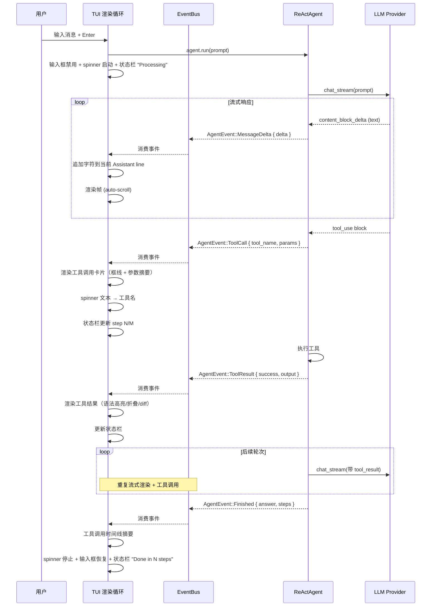
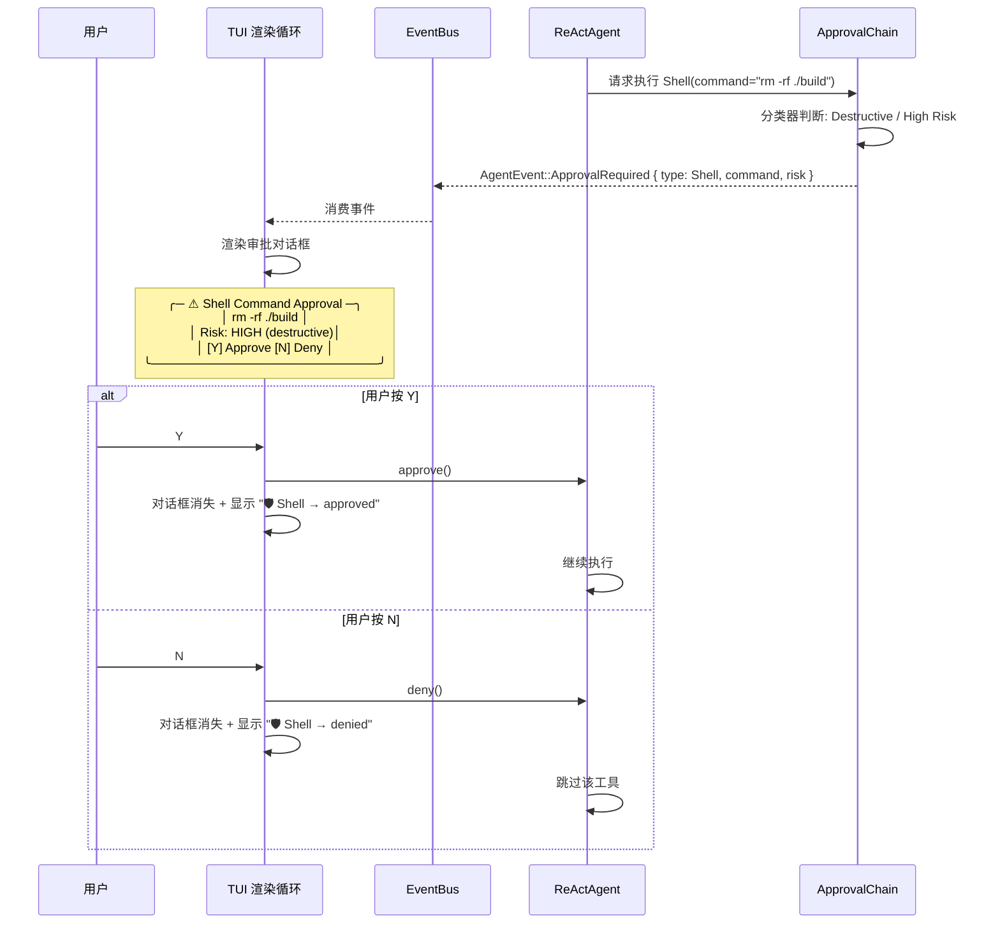
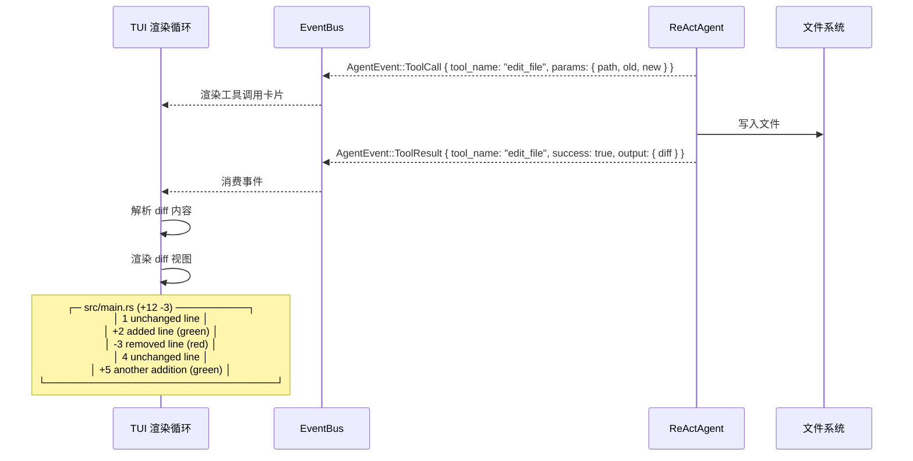
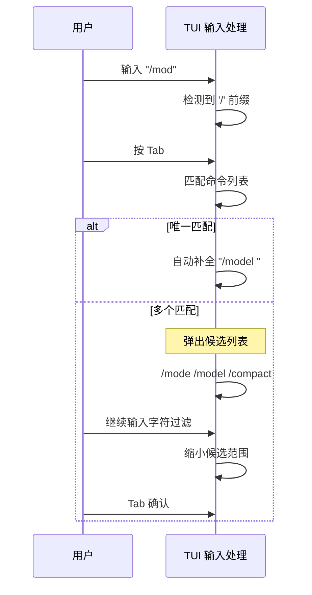
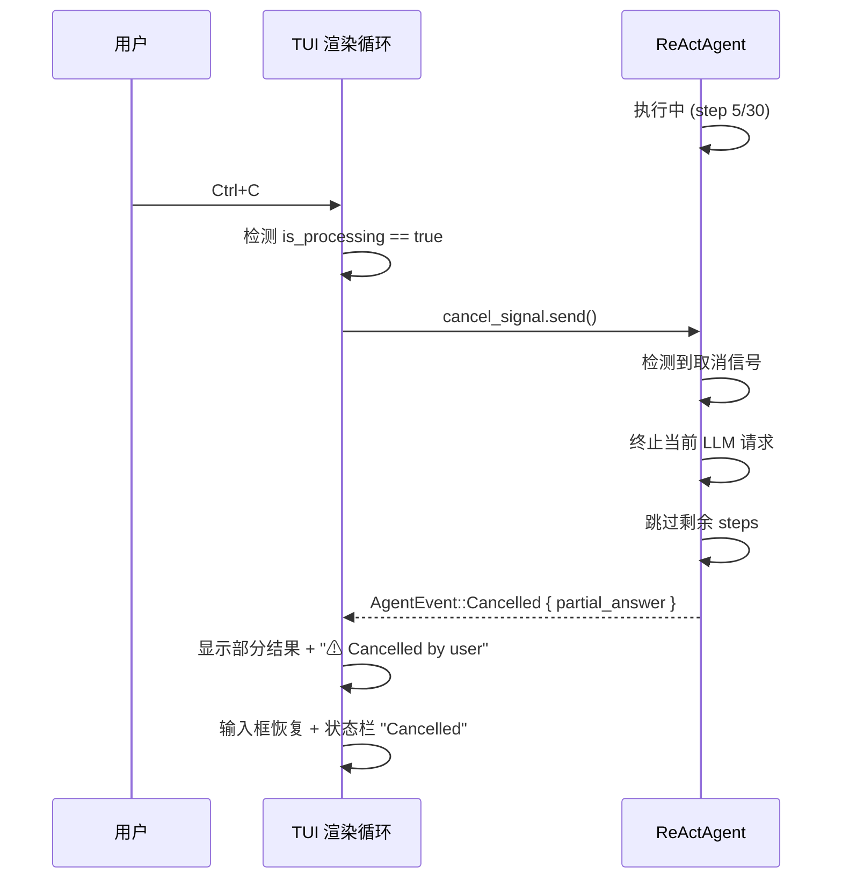

# RGoat TUI UX 增量 PRD — 向 Claude Code 体验对齐

> 版本: v1.0
> 作者: 许清楚（产品经理 #2）
> 日期: 2026-07-07
> 类型: 增量 PRD（仅描述 MVB 完成后 TUI 体验变更部分）
> 父文档: `MVB_PRD.md` v1.0

---

## 1. 变更范围

本 PRD 聚焦 **rgoat-tui** 的交互体验升级，目标是将当前"可用"的终端界面提升到与 Claude Code 对标的"流畅、直观、信息丰富"水平。所有后端功能（工具、Agent 循环、Provider）假定已在 MVB 阶段完成，本 PRD **仅处理 TUI 层的渲染与交互**。

| 维度 | MVB 现状 | 目标状态 |
|------|---------|---------|
| 流式输出 | AgentEvent 非流式文本块（`Message` event 一次性投递） | 字符级流式渲染，思考过程实时可见 |
| 工具调用 | 简单文字行：🔧 工具名 → ✓ 结果摘要 | 可折叠工具卡片、语法高亮输出、Diff 预览 |
| Diff 查看 | 不存在 | 编辑操作后展示彩色 unified diff |
| 权限审批 | 内联文字：🛡 工具 → 决定 | 框线对话框、工具风险摘要、一键 approve/deny |
| 进度指示 | 文字状态栏 `Thinking (step 3/30)...` | Spinner 动画 + 进度条 + 步数统计 |
| 状态栏 | 标题行混合显示所有信息 | 独立底部状态栏：模式、模型、token 用量、耗时 |
| 命令补全 | 无 | Tab 触发：斜杠命令补全 + 文件路径补全 |
| 语法高亮 | 无 | 代码块 syntax highlighting（syntect） |
| Ctrl+C 中断 | 仅退出程序 | 运行中中断 Agent 线程 |
| 会话管理 | 文字版 /list、/resume | 交互式会话选择器（模糊过滤） |

---

## 2. 竞品 UX 对比

### 2.1 整体对比矩阵

| UX 维度 | RGoat (MVB 现状) | Claude Code | Aider | Codex CLI |
|---------|-----------------|-------------|-------|-----------|
| **TUI 框架** | ratatui (Rust) | 自研 Ink/React 渲染引擎 | readline 行内交互 | 自研 TUI |
| **流式输出** | 文本块投递（非流式） | 字符级流式 + Markdown 增量渲染 | 非流式，一次性返回 diff | 流式文本输出 |
| **思考过程** | 💭 单行文字（Thought event） | 可折叠思考块 + 独特动画指示器 | 无思考过程展示 | 无显式思考展示 |
| **工具调用** | 🔧/✓ 单行文字 + 简短摘要 | 工具卡片 + 可折叠输出 + 语法高亮 + 耗时统计 | 无工具可视化（直接返回 diff） | 步骤编号列表 + 分步展示 |
| **Diff 查看** | ❌ 不存在 | 彩色 unified diff + 行内差异标注 | Git diff + SEARCH/REPLACE 块 | patch/diff 补丁展示 |
| **权限审批** | 内联文字行 | 专用权限对话框（约10种），框线绘制 | 无（每次编辑自动 commit） | y/n 确认 + 计划预览 |
| **进度指示** | 文字状态栏 | braille spinner + 进度条 + FPS 追踪 | 无 | 无 |
| **状态栏** | 混在标题行 | 独立底部栏：模型/模式/token/费用/Git | 无 | 无 |
| **命令补全** | ❌ | Tab 补全（命令、文件路径、模型名） | 无 | 有限 |
| **语法高亮** | ❌ | syntect 语法高亮 | 终端默认颜色 | 有限 |
| **Ctrl+C** | 退出程序 | 中断当前操作 | 中断当前操作 | 中断当前操作 |
| **会话切换** | /list + /resume 手动输入 ID | 交互式模糊过滤选择器 | 无会话概念 | /side 侧边对话 |
| **多窗格** | 单一面板 | 消息+工具状态+待办列表 | 纯 REPL 单行 | 无 |
| **鼠标支持** | ❌ | 点击展开、滚动、文本选择 | ❌ | ❌ |
| **终端适应** | 固定布局 | 尺寸感知 + 自动换行 | 自适应 | 自适应 |
| **颜色主题** | 硬编码色彩 | 多主题（dark/light/solarized/catppuccin） | 终端默认 | 终端默认 |
| **分页器** | ❌ | 长输出自动分页（j/k/q） | ❌ | ❌ |

### 2.2 Claude Code 的核心差异化 UX 特征

Claude Code 的 TUI 体验优势来源于其 **自研 Ink/React 渲染管线 + Flexbox 布局引擎 + 屏幕差分更新**：

| 特征 | 描述 | RGoat 优先级 |
|------|------|-------------|
| React 声明式渲染 | 组件树 + Fiber Reconciler，多区域独立刷新 | P2（架构不同，ratatui 有自己的方式） |
| 字符池优化 | 整数 ID 替代字符串比较，降低 24000 字符/帧的渲染开销 | P2（ratatui 已有 diff 更新机制） |
| 工具调用卡片 | 框线包裹 + 工具名着色 + 可折叠输出 + 语法高亮 | **P0** |
| 10 种权限对话框 | 针对不同工具类型的专用审批 UI | **P0**（先做 3 种核心的） |
| 实时 token/费用计数 | 状态栏实时更新 | **P0** |
| Diff 并排对比 | 文件编辑前后的语法高亮对比 | **P0** |
| Spinner + 提示旋转 | braille spinner + 上下文相关的旋转提示 | **P1** |
| 模糊选择器 | 交互式列表（上下选择、回车确认、输入过滤） | **P1** |

### 2.3 Aider 的可借鉴模式

Aider 与 RGoat 定位不同（Aider 是"编辑→diff→commit"直接模式，RGoat 是 ReAct Agent 循环），但仍有借鉴价值：

- **SEARCH/REPLACE 编辑格式**：在工具结果中展示的 search/replace 块可复用为 diff 显示的输入源
- **Git 自动 commit**：可作为 RGoat 的可选特性
- **IDE Watch 模式**：Aider 监视文件变化并响应 AI 注释——可作为远期差异化方向

### 2.4 Codex CLI 的可借鉴模式

- **计划预览→审批确认→分步执行** 的三段式 UX：与 RGoat 的 Plan Mode 天然契合
- **`/side` 侧边对话**：不中断主任务开临时对话——差异化的会话管理能力
- **工具菜单**：展示当前挂载的工具列表——RGoat 可用 `/tools` 命令实现

---

## 3. 用户故事

### P0 — 阻塞性（必须交付）

| # | 用户故事 | 验收标准 |
|---|---------|---------|
| **US-T01** | As a TUI 用户，I want Agent 的思考过程和回复**实时流式渲染**，so that 长回复时能边等边读，不用等到全部完成 | `MessageDelta` 事件逐字符/逐词推送到 TUI；新字符出现时自动滚动到底部；打字速度可配置（默认无延迟） |
| **US-T02** | As a TUI 用户，I want 工具调用过程**清晰可视化**（工具名、输入参数摘要、输出内容/语法高亮、耗时统计），so that 我能快速理解 Agent 在做什么 | 工具调用显示为框线卡片（`╭─ tool_name ─╮`）；代码输出启用 syntect 语法高亮；结果 >15 行时默认折叠，按 Enter 展开 |
| **US-T03** | As a TUI 用户，I want 文件编辑操作展示**彩色 unified diff**，so that 我能一眼看出代码改了什么 | `edit_file`/`write_file` 成功后渲染 diff；删除行红色、新增行绿色、上下文行不变；标题显示文件路径和变更统计（+N -M） |
| **US-T04** | As a TUI 用户，I want 敏感操作弹出**清晰的审批对话框**，so that 我能快速判断风险并做出决定 | 三种核心对话框：Shell 命令（显示完整命令+风险等级）、文件写入（显示路径+新/旧文件）、网络请求（显示 URL+域名）；按 Y/N 批准/拒绝 |
| **US-T05** | As a TUI 用户，I want 底部**实时状态栏**显示当前模式、模型、token 用量、轮次耗时，so that 我对运行状态一目了然 | 状态栏固定底部 1 行；左→右依次显示: 模式 | 模型 | token统计 | 耗时 | Git分支；token 和耗时随事件实时刷新 |
| **US-T06** | As a TUI 用户，I want 按 **Ctrl+C 中断**正在运行的 Agent，so that 无意执行的操作可立即停止 | 运行中 Ctrl+C → 向 Agent 发送取消信号 → Agent 退出当前步骤 → 保留已产生的对话历史；空闲中 Ctrl+C → 退出程序 |

### P1 — 体验增强（应该交付）

| # | 用户故事 | 验收标准 |
|---|---------|---------|
| **US-T07** | As a TUI 用户，I want Tab 触发**斜杠命令和文件路径补全**，so that 输入效率更高 | 输入 `/` 后 Tab → 弹出命令列表；输入字母后 Tab → 过滤匹配命令；输入文件路径时 Tab → 文件系统补全 |
| **US-T08** | As a TUI 用户，I want 代码块显示**语法高亮**，so that 代码可读性大幅提升 | Assistant 回复中的 ``` ``` 代码块通过 syntect 渲染；支持自动语言检测（基于语言标识符或启发式判断） |
| **US-T09** | As a TUI 用户，I want 长时间操作显示**spinner 动画 + 进度提示**，so that 我知道系统没有卡死 | braille spinner 在状态栏旋转；ToolStart 事件时 spinner 文本变为工具名；额外显示 "step N/M" 计数 |
| **US-T10** | As a TUI 用户，I want 工具调用完成后显示**紧凑时间线摘要**，so that 能快速回顾本轮操作 | 格式: `🔧 bash → ✓ | read_file → ✓ | edit_file → ✓ (3 tools, 1.2s)`；在 Agent 回复完成后插入 |
| **US-T11** | As a TUI 用户，I want 使用**交互式会话选择器**切换/恢复会话，so that 不依赖记 ID | `/sessions` 弹出模糊过滤列表；上下箭头选择 + 回车恢复；输入字符实时过滤 |
| **US-T12** | As a TUI 用户，I want 终端窗口大小变化时布局**自动适应**，so that 不会出现截断或错位 | 监听终端 resize 事件；状态栏宽度自适应；消息区高度随终端变化 |

### P2 — 锦上添花（远期优化）

| # | 用户故事 | 验收标准 |
|---|---------|---------|
| **US-T13** | As a TUI 用户，I want 支持多套**颜色主题**切换（dark/light/solarized），so that 适应不同终端配色偏好 | `/theme` 命令切换；持久化到配置文件 |
| **US-T14** | As a TUI 用户，I want 长输出内容使用**分页器**浏览，so that 不会被海量输出刷屏 | 当输出行数 > 终端高度时，进入分页模式（j/k 上下滚动，q 退出） |
| **US-T15** | As a TUI 用户，I want **鼠标点击**展开工具结果、滚动对话，so that 操作更直观 | 鼠标滚轮滚动消息区；点击折叠的工具结果展开 |
| **US-T16** | As a TUI 用户，I want 按 `?` 显示**键盘快捷键面板**，so that 无需记忆快捷键 | 覆盖层弹窗列出所有快捷键及说明；按 Esc 关闭 |
| **US-T17** | As a TUI 用户，I want `/side` 开启**侧边对话**，so that 主任务不被打断的情况下快速问一个问题 | 侧边对话在独立上下文中运行；结果展示后可关闭并回到主对话 |

---

## 4. 关键交互流程（Mermaid 时序图）

### 4.1 流式 Agent 响应流程（US-T01, US-T02, US-T05）



### 4.2 权限审批交互流程（US-T04）



### 4.3 Diff 查看流程（US-T03）



### 4.4 命令补全流程（US-T07）



### 4.5 Ctrl+C 中断流程（US-T06）



---

## 5. UI 设计草案

### 5.1 目标布局

```
┌─ RGoat v0.2 | session:a3f2b1 | Ctrl+C quit ─────────────────────────┐
│                                                                       │
│  You ▶ 帮我重构 src/auth.rs 的认证逻辑                                │
│                                                                       │
│  Goat ▶ 好的，我先读取相关文件了解当前结构...                          │
│                                                                       │
│  ╭─ 🔧 read_file ──────────────────────────────────────────────╮     │
│  │  src/auth.rs                                                 │     │
│  ├──────────────────────────────────────────────────────────────┤     │
│  │  1  pub struct AuthManager { ... }                           │     │
│  │  2  impl AuthManager {                                       │     │
│  │  3      pub fn authenticate(...) -> Result<Token> { ... }    │     │
│  │  ... (45 lines)  [▼ collapsed — Enter to expand]            │     │
│  ╰──────────────────────────────────────────────────────────────╯     │
│                                                                       │
│  Goat ▶ 我看到了当前实现。问题在于 authenticate 耦合了数据库查询，     │
│         我将提取一个 AuthProvider trait 来解耦...                     │
│                                                                       │
│  ╭─ 🔧 edit_file ─────────────────────────────────────────────╮      │
│  │  src/auth.rs  (modified)                                    │      │
│  ├─────────────────────────────────────────────────────────────┤      │
│  │ -    fn authenticate(&self, creds: Creds) -> Result<Token> │      │
│  │ +    fn authenticate(&self, creds: Creds, provider: &dyn   │      │
│  │ +        AuthProvider) -> Result<Token>                    │      │
│  │ ... (+45 -12 in 3 files)                                   │      │
│  ╰─────────────────────────────────────────────────────────────╯      │
│                                                                       │
│  🔧 read_file → ✓ | edit_file → ✓ (2 tools, 0.8s)                    │
│                                                                       │
│  Goat ▶ 完成。我提取了 AuthProvider trait，并更新了三处调用点...      │
│                                                                       │
├─ agent | claude-sonnet-4 | 2.3K tok | 1.2s | main ──────────────────┤
│                                                                       │
├─ Input (/help for commands) ─────────────────────────────────────────┤
│ agent > ▌                                                             │
└───────────────────────────────────────────────────────────────────────┘
```

### 5.2 工具调用卡片组件

```
╭─ 🔧 tool_name ────────────────────────────────╮
│  param_summary (单行，灰色斜体)                 │
├────────────────────────────────────────────────┤
│  output content (语法高亮，最多 15 行)         │
│  ...                                           │
│  [▼ collapsed — Enter to expand] (如果被截断) │
╰────────────────────────────────────────────────╯
```

### 5.3 审批对话框组件

```
╭─ ⚠ Shell Command Approval ──────────────────────╮
│                                                   │
│  $ rm -rf ./build                                 │
│                                                   │
│  Risk: HIGH (destructive operation)                │
│  Affects: ./build (workspace subdirectory)         │
│                                                   │
│  [Y] Approve once    [A] Approve all    [N] Deny  │
│                                                   │
╰───────────────────────────────────────────────────╯
```

### 5.4 状态栏设计

```
 agent | claude-sonnet-4 | ↑ 2.3K ↓ 1.1K | $0.04 | 1.2s | main
 ─────   ────────────────   ──────────────   ─────   ────   ────
 模式     当前模型            Token 统计      费用    耗时   Git分支
```

---

## 6. 需求池

### P0 — 阻塞性（6项）

| ID | 需求 | 关联故事 | 预估复杂度 |
|----|------|---------|-----------|
| P0-T01 | **流式渲染引擎**：改造 EventBus 消费循环，增量渲染 MessageDelta 事件到 TUI | US-T01 | M（3-5天） |
| P0-T02 | **工具调用卡片组件**：框线渲染 + 参数摘要 + 语法高亮输出 + >15行折叠 | US-T02 | M（3-5天） |
| P0-T03 | **Diff 视图组件**：解析 edit_file/write_file 工具结果中的 diff，彩色渲染 | US-T03 | S（1-2天） |
| P0-T04 | **审批对话框系统**：模态框组件 + 3 种核心对话框（Shell/Write/Network） | US-T04 | M（3-5天） |
| P0-T05 | **实时状态栏**：独立底部栏 + token 计数 + 耗时 + Git 分支 | US-T05 | S（2-3天） |
| P0-T06 | **Ctrl+C 中断机制**：cancel signal 通道 + Agent 端响应 + TUI 状态恢复 | US-T06 | S（1-2天） |

### P1 — 体验增强（6项）

| ID | 需求 | 关联故事 | 预估复杂度 |
|----|------|---------|-----------|
| P1-T01 | **Tab 命令补全**：命令注册表 + 模糊匹配 + 候选列表渲染 | US-T07 | M（3-5天） |
| P1-T02 | **语法高亮引擎**：集成 syntect + 语言检测 + 主题配色映射 | US-T08 | M（3-5天） |
| P1-T03 | **Spinner 动画系统**：braille spinner + 上下文提示切换 + 步数显示 | US-T09 | S（1-2天） |
| P1-T04 | **工具时间线摘要**：工具调用完成后自动插入紧凑统计行 | US-T10 | S（1天） |
| P1-T05 | **交互式会话选择器**：模糊过滤列表 + 键盘导航 + 预览 | US-T11 | M（2-3天） |
| P1-T06 | **终端 resize 自适应**：监听 SIGWINCH / crossterm resize 事件 + 布局重算 | US-T12 | S（1天） |

### P2 — 远期优化（5项）

| ID | 需求 | 关联故事 | 预估复杂度 |
|----|------|---------|-----------|
| P2-T01 | **颜色主题系统**：多主题定义 + 切换命令 + 配置持久化 | US-T13 | M（3-5天） |
| P2-T02 | **内部分页器**：j/k 滚动 + q 退出 + 行号显示 | US-T14 | S（2-3天） |
| P2-T03 | **鼠标支持**：crossterm mouse events + 滚轮滚动 + 点击展开 | US-T15 | M（2-3天） |
| P2-T04 | **快捷键面板**：`?` 弹出覆盖层 + 快捷键列表 | US-T16 | S（1天） |
| P2-T05 | **侧边对话 /side**：独立上下文 + 快速切换 + 结果回传机制 | US-T17 | L（5-7天） |

---

## 7. 技术实现要点

### 7.1 流式渲染架构（P0-T01）

```
现状: AgentEvent::Message { content } — 一次性投递全部文本
目标: AgentEvent::MessageDelta { delta: String } — 逐 delta 投递

需要变更:
1. rgoat-core: AgentEvent 枚举增加 MessageDelta 变体
2. rgoat-core: ReActAgent 在 Provider::chat_stream 回调中发送 MessageDelta
3. rgoat-tui: App::handle_agent_event 中 MessageDelta 分支 → 追加到当前 UiLine 而非新增一行
4. rgoat-tui: 渲染时对当前行做 Markdown 增量解析（可选：初期先纯文本流式）

关键约束:
- 流式渲染必须与 UI 事件循环共存（不能阻塞 UI 绘制）
- 每 50ms 轮询一次 EventBus 已足够（当前已有 poll 机制）
- 自动滚动: 当 scroll_offset == 0 时自动跟随新内容
```

### 7.2 工具调用卡片渲染（P0-T02）

```
ratatui 实现方案:
- 使用 Block::bordered() 渲染框线
- 使用 Paragraph 渲染内容（支持多行 + 样式）
- 折叠状态存储: UiLine::ToolStart 增加 collapsed: bool 字段
- 展开/折叠: Enter 键处理，轮询 key event 时检测

语法高亮:
- 依赖: syntect crate (纯 Rust，无外部依赖)
- 订阅文件: Sublime .sublime-syntax 或 .tmTheme
- 内置默认主题: "base16-ocean.dark"
- 语言检测: 基于 tool_name 推断（bash→shell script, read_file→按文件扩展名）
```

### 7.3 Diff 渲染（P0-T03）

```
输入: edit_file/write_file 工具结果中的 unified diff 文本
解析: 按行分割 → 识别 +/-/@@ 前缀
渲染:
  -  行 → Style::default().fg(Color::Red).bg(Color::from_u32(0x330000))
  +  行 → Style::default().fg(Color::Green).bg(Color::from_u32(0x003300))
  @@ 行 → Style::default().fg(Color::Cyan).add_modifier(Modifier::BOLD)
  上下行→ Style::default().fg(Color::DarkGray)
边界: diff 最多展示 50 行，超过则折叠中间部分并标 "… (N lines omitted) …"
```

### 7.4 审批对话框（P0-T04）

```
实现方式: 模态覆盖层（modal overlay）

ratatui 实现:
- App 状态增加 approval_state: Option<ApprovalDialog>
- ApprovalDialog { tool_type, summary, risk_level, command, path }
- UI 渲染时，如果 approval_state.is_some() → 在消息区上方绘制半透明遮罩 + 对话框
- 键盘事件处理: 审批状态下仅响应 Y/N/A/Esc
- 审批结果通过 EventBus 回传给 Agent

三种核心对话框:
1. ShellApproval: 显示完整命令 + 风险等级（LOW/MEDIUM/HIGH）
2. WriteApproval: 显示文件路径 + 新/旧对比摘要
3. NetworkApproval: 显示 URL + 域名 + 请求类型
```

### 7.5 状态栏（P0-T05）

```
ratatui 实现:
- 固定底部 1 行高度
- 使用 Paragraph 组件，内容为格式化字符串
- 数据来源:
  - mode: self.mode_display()
  - model: self.current_provider
  - tokens: AgentEvent::Usage { input_tokens, output_tokens } (需新增)
  - cost: 基于 token 数和模型单价估算
  - duration: Instant::now() - processing_start_time
  - git: git2 crate 读取当前分支名

更新频率: 每次 render 时实时计算 duration（低开销字符串格式化）
```

### 7.6 Ctrl+C 中断（P0-T06）

```
实现:
1. rgoat-core: ReActAgent 增加 cancel_token: tokio_util::sync::CancellationToken
2. rgoat-core: AgentEvent 增加 Cancelled { partial_answer: String }
3. rgoat-tui: Ctrl+C 处理分支:
   - if is_processing → cancel_token.cancel() → 不退出
   - else → return Ok(()) (退出程序)
4. ReActAgent: 每次 LLM 调用前检查 cancel_token.is_cancelled()

注意: 
- 首次 Ctrl+C → 中断 Agent
- 第二次 Ctrl+C（Agent 已中断）→ 退出程序
- 中断后保留已产生的对话历史和部分结果
```

---

## 8. 里程碑建议

### Phase 1: 核心体验对齐 (P0, ~2 周)

目标：达到 Claude Code 60% 的 TUI 体验水平

| 交付物 | 说明 |
|--------|------|
| 流式渲染引擎 | MessageDelta 事件 + 增量 TUI 渲染 |
| 工具调用卡片 | 框线 + 折叠 + 语法高亮 |
| Diff 视图 | 彩色 unified diff |
| 审批对话框 | Shell/Write/Network 三种 |
| 状态栏 | 模式/模型/token/耗时/Git |
| Ctrl+C 中断 | cancel signal 机制 |

### Phase 2: 体验增强 (P1, ~1.5 周)

目标：达到 Claude Code 80% 的 TUI 体验水平

| 交付物 | 说明 |
|--------|------|
| Tab 补全 | 命令 + 文件路径 |
| Spinner 动画 | braille + 上下文提示 |
| 工具时间线摘要 | 紧凑统计行 |
| 交互式会话选择器 | 模糊过滤 |
| 终端 resize 适应 | 动态布局 |

### Phase 3: 差异化体验 (P2, ~2 周)

目标：在部分维度超越 Claude Code

| 交付物 | 说明 |
|--------|------|
| 多颜色主题 | dark/light/solarized |
| 内部分页器 | 长输出浏览 |
| 鼠标支持 | 点击 + 滚轮 |
| 快捷键面板 | ? 覆盖层 |
| /side 侧边对话 | 差异化能力 |

---

## 9. 待确认问题

| # | 问题 | 选项 | 影响范围 |
|---|------|------|---------|
| Q1 | **流式渲染粒度**：MessageDelta 是逐字符还是逐词推送？逐字符体验更好但 EventBus 消息量更大（可能数千条/次），逐词更经济但可能显得卡顿 | A) 逐词（空格分隔）B) 逐字符 C) 可配置 | EventBus 吞吐 + 渲染性能 |
| Q2 | **AgentEvent 是否需要增加 Usage 事件**来支持 token 计数？当前 AgentEvent 没有 Usage 变体，Anthropic 流式响应中有 `message_delta.usage` | A) 新增 Usage 事件 B) 从现有事件中推断 | AgentEvent 枚举 + Provider 层适配 |
| Q3 | **语法高亮用 syntect 还是 tree-sitter？** syntect 更轻量（Sublime 语法定义），tree-sitter 更准确但依赖大 | A) syntect（轻量优先）B) tree-sitter（准确优先）C) syntect 默认 + tree-sitter 可切换 | 编译体积 + 高亮质量 |
| Q4 | **审批对话框是否阻塞 UI 渲染？** 模态框阻塞时 EventBus 仍在接收事件，是否需要后台继续渲染 Agent 响应？ | A) 阻塞模式（审批期间暂停所有渲染）B) 非阻塞模式（后台继续渲染，对话框浮在最上层） | UI 架构 + 用户体验 |
| Q5 | **Diff 数据来源**：是从工具输出解析 unified diff 文本，还是让 Agent 返回结构化 diff 数据？ | A) 解析文本 diff（兼容性好）B) 结构化 diff 数据（渲染更精确）C) 两者都支持（fallback） | 工具输出格式 + TUI 解析逻辑 |
| Q6 | **P0 阶段是否需要 MessageDelta 枚举变更**（涉及 rgoat-core API 变更）？还是可以仅在 TUI 端做"伪流式"（收到 Message 后逐词渲染）？ | A) 改 rgoat-core API（正本清源，但跨 crate 变更）B) TUI 端伪流式（更快，但非真正的流式事件）C) 两者并行：先 B 快速上线，后 A 优化 | rgoat-core API 稳定性 + 交付速度 |
| Q7 | **状态栏是否需要可自定义**（类似 Claude Code 的 statusline 脚本）？ | A) 硬编码格式（MVB 阶段）B) 支持配置模板字符串 C) 支持外部脚本渲染 | 灵活性 vs 复杂度 |

---

## 附录：与上游文档的关系

- 本 PRD 是 `MVB_PRD.md` 的增量，MVB 中的斜杠命令系统（P0-09）在本 PRD 中增强为带补全的版本
- `competitive-benchmarking-report.md` 中的 TUI 缺口（2.10 节）已在本 PRD 中转化为具体用户故事和需求
- `upgrade-roadmap.md` 中的 Phase 3（TUI 体验升级）对应本 PRD 的 Phase 1+2
