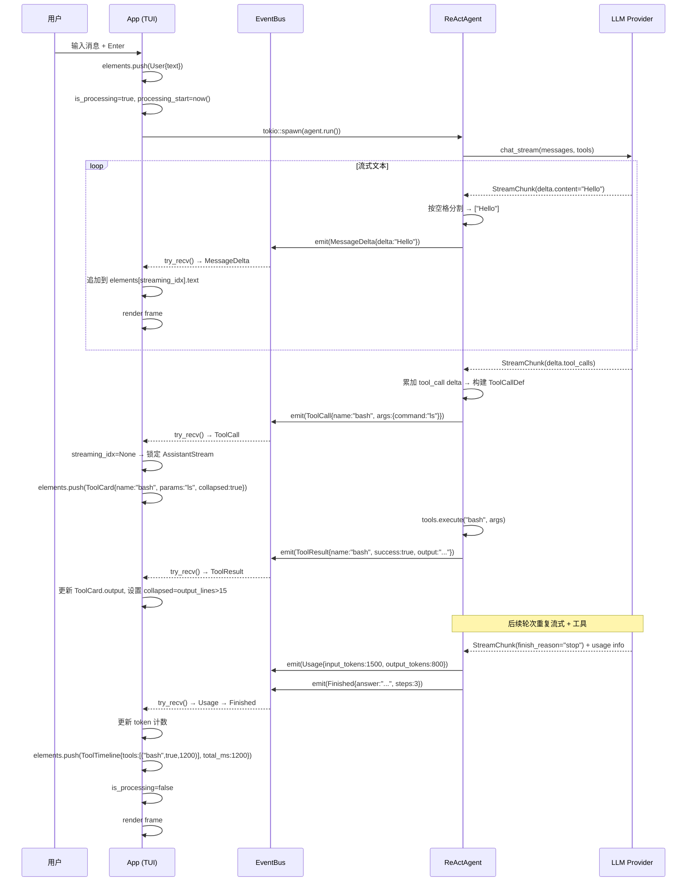
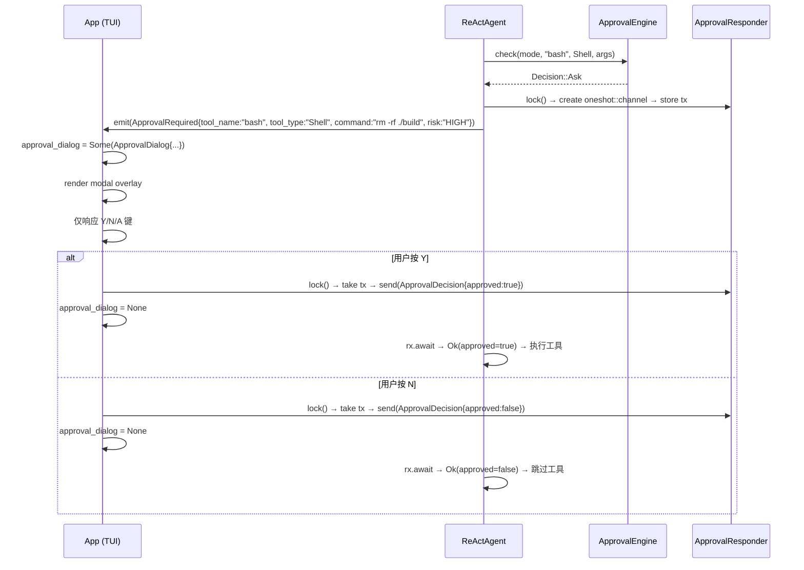
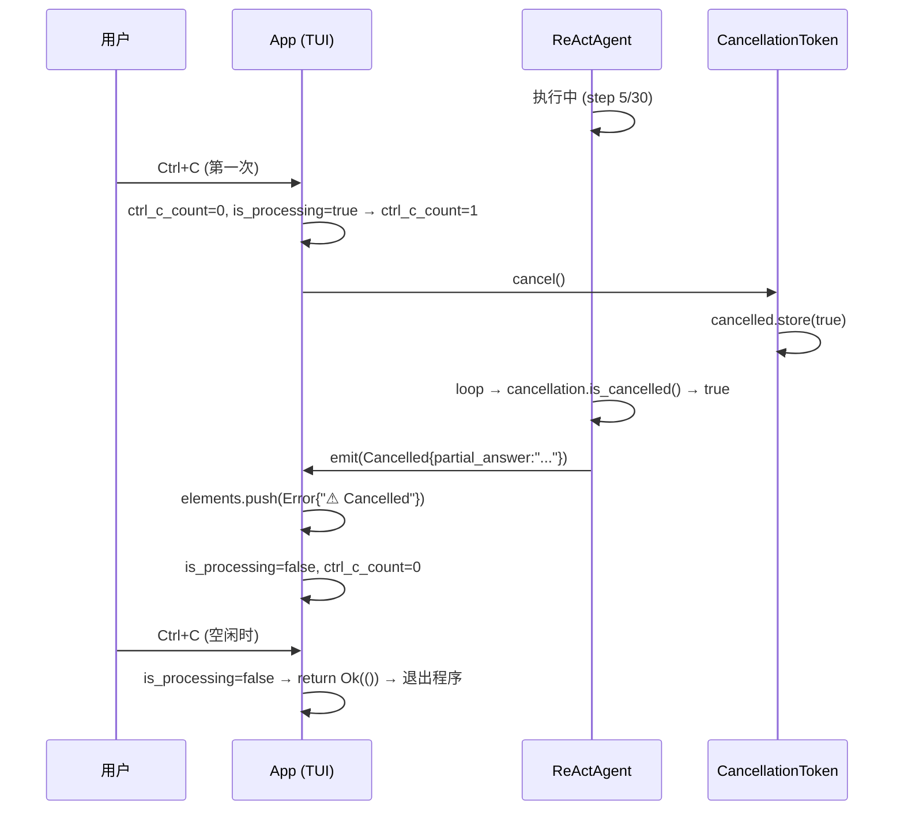
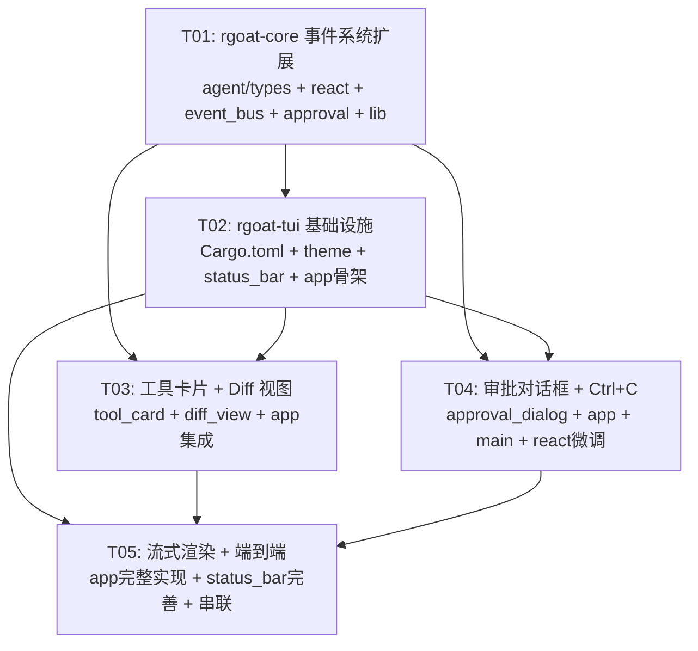

# RGoat TUI UX Phase 1 — 系统设计文档

> 版本: v1.0
> 作者: Bob（架构师）
> 日期: 2026-07-07
> 父文档: `prd-tui-ux.md` v1.0

---

## Part A: 系统设计

### 1. 实现方案

#### 1.1 核心技术挑战

| 挑战 | 分析 |
|------|------|
| **流式渲染** | rgoat-core 已有 `chat_stream`，但当前将每个 chunk 作为独立 `Thought` 事件发出。需要新增 `MessageDelta` 事件，逐词（空格分隔）推送，TUI 端增量追加到当前行 |
| **语法高亮** | PRD 指定 `syntect`（纯 Rust，Sublime 语法定义），集成到工具卡片的代码输出区 |
| **审批阻塞** | Phase 1 采用阻塞模式：Agent 发出 `ApprovalRequired` 后挂起等待，TUI 显示模态对话框，用户在 Y/N 后通过 `ApprovalResponder`（`oneshot` channel）回传决策 |
| **Diff 渲染** | 解析工具输出中的 unified diff 文本（+/-/@@ 前缀），彩色渲染 |
| **Ctrl+C 中断** | 首次中断 Agent（`CancellationToken::cancel()`），二次退出；`CancellationToken` 已存在，只需在 TUI 端加状态追踪 |
| **状态栏** | 硬编码格式（`agent | model | ↑N ↓M | Ns | branch`），实时刷新 |

#### 1.2 框架/库选型

| 用途 | 选型 | 理由 |
|------|------|------|
| TUI 框架 | `ratatui 0.29` | 已集成，无需变更 |
| 终端控制 | `crossterm 0.28` | 已集成 |
| 语法高亮 | `syntect 5` | PRD 已确认；纯 Rust，无外部依赖；内置 Sublime 语法定义 + 主题 |
| Git 分支读取 | `git2 0.19` | rgoat-core 已依赖，rgoat-tui 新增依赖（轻量复用） |
| 审批通道 | `tokio::sync::oneshot` | 标准库，轻量；Agent 等待 oneshot::Receiver，TUI 通过 oneshot::Sender 回传 |

#### 1.3 架构模式

```
┌─────────────────────────────────────────────────────┐
│  rgoat-tui (Presentation Layer)                     │
│  ┌─────────┐  ┌──────────────────────────────────┐  │
│  │ app.rs  │  │ components/                       │  │
│  │ (状态管理│  │ ├─ tool_card.rs    (工具框线卡片)  │  │
│  │  事件循环│  │ ├─ diff_view.rs    (Diff 渲染)    │  │
│  │  渲染调度│  │ ├─ approval_dialog (审批模态框)   │  │
│  │         │  │ ├─ status_bar.rs   (底部状态栏)   │  │
│  │         │  │ └─ theme.rs        (颜色常量)      │  │
│  └────┬────┘  └──────────────────────────────────┘  │
│       │  EventBus (broadcast)                        │
│       │  + ApprovalResponder (oneshot)                │
├───────┼──────────────────────────────────────────────┤
│  rgoat-core (Domain Layer)                           │
│  ┌────┴─────┐  ┌─────────────────────────────────┐  │
│  │ agent/   │  │ core/                            │  │
│  │ └ react  │  │ ├─ event_bus (EventType: 新增)   │  │
│  │ └ types  │  │ └─ cancellation (已有, 无需改)   │  │
│  ├──────────┤  ├─────────────────────────────────┤  │
│  │ security │  │ provider/                        │  │
│  │ └ approv │  │ └ provider (已有, 无需改)        │  │
│  └──────────┘  └─────────────────────────────────┘  │
└─────────────────────────────────────────────────────┘
```

---

### 2. 文件列表

#### 新建文件

| # | 相对路径 | 说明 |
|---|---------|------|
| 1 | `rgoat-tui/src/components/mod.rs` | 组件模块入口，子模块声明与 re-export |
| 2 | `rgoat-tui/src/components/theme.rs` | 全局颜色常量、Style 工厂函数 |
| 3 | `rgoat-tui/src/components/status_bar.rs` | 底部状态栏组件（模式/模型/token/耗时/Git） |
| 4 | `rgoat-tui/src/components/tool_card.rs` | 工具调用卡片组件（框线 + syntect 语法高亮 + 折叠） |
| 5 | `rgoat-tui/src/components/diff_view.rs` | Diff 视图组件（unified diff 解析 + 彩色渲染） |
| 6 | `rgoat-tui/src/components/approval_dialog.rs` | 审批模态对话框（Shell/Write/Network） |

#### 修改文件

| # | 相对路径 | 变更说明 |
|---|---------|---------|
| 7 | `rgoat-core/src/agent/types.rs` | `AgentEvent` 枚举：新增 `MessageDelta`、`Usage`、`Cancelled`、`ApprovalRequired` 变体 |
| 8 | `rgoat-core/src/agent/react.rs` | ReActAgent：流式循环改发 `MessageDelta`；流结束后发 `Usage`；取消时发 `Cancelled`；审批时通过 `ApprovalResponder` 等待 |
| 9 | `rgoat-core/src/core/event_bus.rs` | `EventType` 枚举：新增 `MessageDelta`、`Usage`、`ApprovalRequired`、`AgentCancelled` |
| 10 | `rgoat-core/src/security/approval.rs` | 新增 `ApprovalDecision` 结构体、`ApprovalResponder` 类型别名 |
| 11 | `rgoat-core/src/lib.rs` | Re-export 新增类型 |
| 12 | `rgoat-tui/Cargo.toml` | 新增依赖：`syntect`、`git2` |
| 13 | `rgoat-tui/src/app.rs` | 全面重构：`UiElement` 枚举、流式追加、审批状态、Ctrl+C 逻辑、状态栏数据、布局调整 |
| 14 | `rgoat-tui/src/main.rs` | 传递 `ApprovalResponder` 到 App 构造 |

---

### 3. 数据结构与接口

```mermaid
classDiagram
    direction TB

    class AgentEvent {
        <<enumeration>>
        +Started { mode, prompt }
        +Thought { step, content }
        +ToolCall { step, tool_name, arguments }
        +ToolResult { step, tool_name, success, output }
        +Approval { tool_name, decision, message }
        +Message { role, content }
        +MessageDelta { delta: String }
        +Usage { input_tokens: u64, output_tokens: u64 }
        +Cancelled { partial_answer: String }
        +ApprovalRequired { tool_name, tool_type, summary, risk_level, command, path, url }
        +StepCompleted { step, total_steps }
        +Finished { answer, steps }
        +Error { message }
    }

    class ApprovalDecision {
        +approved: bool
        +approve_all: bool
    }

    class ReActAgent {
        +config: AgentConfig
        +provider: Arc~dyn LlmProvider~
        +tools: Arc~ToolRegistry~
        +approval: Arc~ApprovalEngine~
        +conversation: Arc~ConversationManager~
        +event_bus: Arc~EventBus~
        +cancellation: CancellationToken
        +mode: AgentMode
        +paused: Arc~AtomicBool~
        +approval_responder: ApprovalResponder
        +run(session_id, user_prompt, workspace) Result~AgentRunResult, AgentError~
        -call_llm_with_streaming(messages, tools, step) Result~ChatResponse, AgentError~
        -emit(event) ()
        -handle_tool_result(session_id, step, tool_name, tool_call_id, result) ()
    }

    class ApprovalResponder {
        <<type alias>>
        Arc~Mutex~Option~oneshot::Sender~ApprovalDecision~~~
    }

    class UiElement {
        <<enumeration>>
        +User { text: String }
        +Assistant { text: String }
        +AssistantStream { text: String }
        +Thought { step: usize, content: String }
        +ToolCard { name, params, output, collapsed, line_count }
        +DiffView { path, additions, deletions, lines }
        +ToolResult { name, success, summary }
        +ToolTimeline { tools, total_ms }
        +System { text }
        +Error { text }
        +render(width) Vec~Line~
    }

    class DiffLine {
        <<enumeration>>
        +Add(String)
        +Del(String)
        +Context(String)
        +Hunk(String)
    }

    class ApprovalDialog {
        +dialog_type: ApprovalDialogType
        +tool_name: String
        +summary: String
        +risk_level: String
        +command: Option~String~
        +path: Option~String~
        +url: Option~String~
        +render(area) Widget
    }

    class ApprovalDialogType {
        <<enumeration>>
        +Shell
        +Write
        +Network
    }

    class StatusBarData {
        +mode: String
        +model: String
        +input_tokens: u64
        +output_tokens: u64
        +elapsed: Duration
        +git_branch: String
        +render(area) Widget
    }

    class App {
        +agent: Arc~ReActAgent~
        +conversation: Arc~ConversationManager~
        +event_rx: broadcast::Receiver~Event~
        +switch: Arc~ProviderSwitch~
        +approval_responder: ApprovalResponder
        +session_id: String
        +workspace: String
        +elements: Vec~UiElement~
        +input: String
        +mode: AgentMode
        +is_processing: bool
        +input_tokens: u64
        +output_tokens: u64
        +processing_start: Option~Instant~
        +git_branch: String
        +current_step: usize
        +max_steps: usize
        +scroll_offset: usize
        +streaming_idx: Option~usize~
        +approval_dialog: Option~ApprovalDialog~
        +ctrl_c_count: u8
        +init() ()
        +submit() ()
        +handle_agent_event(event) ()
        +handle_key(key) ()
        +poll_events() ()
    }

    class EventBus {
        +sender: broadcast::Sender~Event~
        +new(capacity) Self
        +subscribe() broadcast::Receiver~Event~
        +emit(event_type, source, data) ()
    }

    class EventType {
        <<enumeration>>
        +MessageDelta (NEW)
        +Usage (NEW)
        +ApprovalRequired (NEW)
        +AgentCancelled (NEW)
        +...existing variants
    }

    ReActAgent --> AgentEvent : emits
    ReActAgent --> ApprovalResponder : shares
    ReActAgent --> EventBus : emits to
    App --> UiElement : manages
    App --> ApprovalDialog : renders
    App --> StatusBarData : renders
    App --> ApprovalResponder : sends decision via
    UiElement --> DiffLine : contains
    EventBus --> EventType : uses
```

---

### 4. 程序调用流

#### 4.1 流式渲染 + 工具卡片（全场景）



#### 4.2 审批阻塞流程



#### 4.3 Ctrl+C 中断流程



---

### 5. 待明确事项

| # | 问题 | 假设 |
|---|------|------|
| Q1 | `Usage` 事件的 token 数据来源：当前 `ChatResponse.usage` 在非流式调用中有值，但流式调用结束时 LLM 可能返回 `usage` 在最后一个 chunk 中。当前 `call_llm_with_streaming` 丢弃了 usage | 在流式结束后，从 `StreamChunk` 的最后一个（含 `finish_reason="stop"`）chunk 中提取 usage；若 provider 不支持，则 Usage 事件输入为 0 |
| Q2 | `ApprovalRequired` 事件中 `ToolCategory` 如何映射到 `tool_type` 字符串？ | 新增辅助函数：`ToolCategory::Shell → "Shell"`、`ToolCategory::Write → "Write"`、`ToolCategory::Network → "Network"` |
| Q3 | Diff 解析：工具输出不保证是标准 unified diff 格式 | skip 非 diff 行（不以 `+`/`-`/`@@`/` ` 开头的行），余下按 diff 规则渲染 |
| Q4 | `syntect` 编译体积 | syntect 的 `default-features = false`，仅启用 parsing + highlighting；预编译语法集嵌入 binary |

---

## Part B: 任务分解

### 6. 所需依赖包

```
# rgoat-tui/Cargo.toml 新增:
- syntect = { version = "5", default-features = false, features = ["parsing", "highlighting", "default-syntaxes", "default-themes"] }
- git2 = "0.19"
```

注：`git2 0.19` 与 rgoat-core 已用版本一致，Cargo 自动去重。

---

### 7. 任务列表

#### T01: rgoat-core AgentEvent 扩展 + 流式/Usage/Cancelled/审批通道

| 属性 | 值 |
|------|-----|
| **Task ID** | T01 |
| **Task Name** | rgoat-core 事件系统扩展 |
| **Source Files** | `rgoat-core/src/agent/types.rs`, `rgoat-core/src/agent/react.rs`, `rgoat-core/src/core/event_bus.rs`, `rgoat-core/src/security/approval.rs`, `rgoat-core/src/lib.rs` |
| **Dependencies** | 无 |
| **Priority** | P0 |

**详细内容**：

1. **`agent/types.rs`** — `AgentEvent` 枚举新增：
   - `MessageDelta { delta: String }` — 流式逐词推送
   - `Usage { input_tokens: u64, output_tokens: u64 }` — token 统计
   - `Cancelled { partial_answer: String }` — 取消事件
   - `ApprovalRequired { tool_name: String, tool_type: String, summary: String, risk_level: String, command: Option<String>, path: Option<String>, url: Option<String> }` — 审批请求

2. **`agent/react.rs`** — `ReActAgent` 变更：
   - 新增字段 `approval_responder: ApprovalResponder`
   - `call_llm_with_streaming`：将文本 chunk 改为 emit `MessageDelta`（按空格分词），累加完整文本到 `full_content`
   - 流式结束后 emit `Usage` 事件（从最后 chunk 或 provider 的 usage 获取）
   - `Cancelled` 处理：检测 `cancellation.is_cancelled()` 后 emit `Cancelled{partial_answer}` 再 return
   - `Decision::Ask` 分支：create oneshot channel → store tx in `approval_responder` → emit `ApprovalRequired` → await rx → 根据 decision 执行/跳过
   - `emit()` 函数：新增 `MessageDelta`→`EventType::MessageDelta`、`Usage`→`EventType::Usage`、`Cancelled`→`EventType::AgentCancelled`、`ApprovalRequired`→`EventType::ApprovalRequired`

3. **`core/event_bus.rs`** — `EventType` 枚举新增：
   - `MessageDelta`
   - `Usage`
   - `ApprovalRequired`
   - `AgentCancelled`

4. **`security/approval.rs`** — 新增：
   - `ApprovalDecision { pub approved: bool, pub approve_all: bool }`
   - `pub type ApprovalResponder = Arc<tokio::sync::Mutex<Option<tokio::sync::oneshot::Sender<ApprovalDecision>>>>`

5. **`lib.rs`** — Re-export：
   - `pub use agent::types::{AgentEvent::MessageDelta, ...}`（新变体自动包含）
   - `pub use security::approval::{ApprovalDecision, ApprovalResponder}`

---

#### T02: rgoat-tui 基础设施 — 依赖 + 主题 + 状态栏 + UiElement + App 骨架

| 属性 | 值 |
|------|-----|
| **Task ID** | T02 |
| **Task Name** | rgoat-tui 基础设施与状态栏 |
| **Source Files** | `rgoat-tui/Cargo.toml`, `rgoat-tui/src/components/mod.rs`, `rgoat-tui/src/components/theme.rs`, `rgoat-tui/src/components/status_bar.rs`, `rgoat-tui/src/app.rs` |
| **Dependencies** | T01 |
| **Priority** | P0 |

**详细内容**：

1. **`Cargo.toml`** — 新增 `syntect`、`git2` 依赖

2. **`components/mod.rs`** — 声明子模块：
   ```rust
   pub mod theme;
   pub mod status_bar;
   pub mod tool_card;
   pub mod diff_view;
   pub mod approval_dialog;
   ```

3. **`components/theme.rs`** — 全局颜色常量：
   - `COLORS`: 定义 `DIFF_ADD` (Green)、`DIFF_DEL` (Red)、`DIFF_HUNK` (Cyan)、`DIFF_CTX` (DarkGray)、`TOOL_BORDER` (Yellow)、`APPROVAL_BORDER` (Magenta)、`RISK_HIGH/MEDIUM/LOW`、`STATUS_BG/FG`
   - `style_diff_add()`, `style_diff_del()`, etc. 工厂函数

4. **`components/status_bar.rs`** — `StatusBar` 组件：
   - `StatusBarData` 结构体：mode/model/input_tokens/output_tokens/elapsed/git_branch
   - `StatusBar::render(area, data) -> Paragraph`：格式化 `" agent | claude-sonnet-4 | ↑2.3K ↓1.1K | 1.2s | main "`
   - 用 `Duration` 实时计算 elapsed

5. **`app.rs`** — App 骨架变更（非完整实现，仅结构）：
   - 新增字段：`input_tokens: u64`, `output_tokens: u64`, `processing_start: Option<Instant>`, `git_branch: String`, `streaming_idx: Option<usize>`, `approval_dialog: Option<ApprovalDialog>`, `ctrl_c_count: u8`, `approval_responder: ApprovalResponder`
   - 移除字段：`status_msg: String`（用 StatusBarData 替代）
   - `UiElement` 枚举替换 `UiLine`：新增 `AssistantStream`、`ToolCard`、`DiffView`、`ToolTimeline` 变体
   - `init()` 中读取 git 分支：`git2::Repository::open(&workspace)` → `head().shorthand()`
   - 布局改为 4 区域：`title(1) | chat(Min 3) | status(1) | input(3)`（保留现有结构）

---

#### T03: rgoat-tui 工具卡片 + Diff 视图 + 语法高亮

| 属性 | 值 |
|------|-----|
| **Task ID** | T03 |
| **Task Name** | 工具卡片与 Diff 视图组件 |
| **Source Files** | `rgoat-tui/src/components/tool_card.rs`, `rgoat-tui/src/components/diff_view.rs`, `rgoat-tui/src/app.rs`, `rgoat-tui/src/components/mod.rs` |
| **Dependencies** | T01, T02 |
| **Priority** | P0 |

**详细内容**：

1. **`components/tool_card.rs`** — `ToolCard` 组件：
   - `ToolCardState`：name、params_summary、output、collapsed、output_line_count
   - `render(area, state, width) -> Vec<Line>`：框线 `╭─ 🔧 name ─╮` → params 行 → 分隔线 → 输出（syntect 高亮，最多 15 行）→ 折叠提示
   - `highlight_code(code, language) -> Vec<Span>`：syntect 集成
     - `SyntaxSet::load_defaults_newlines()` 延迟初始化
     - `ThemeSet::load_defaults()["base16-ocean.dark"]`
     - 按语言名查找 syntax，fallback 到 plain text
   - `detect_language(tool_name) -> &str`：`bash/shell`→"Shell Script"、`read_file`→按扩展名推断、默认 "Plain Text"
   - 折叠/展开逻辑：Enter 键切换 `collapsed` 字段

2. **`components/diff_view.rs`** — `DiffView` 组件：
   - `DiffLine` 枚举：`Add(String)`, `Del(String)`, `Context(String)`, `Hunk(String)`
   - `DiffViewState`：file_path、additions、deletions、lines (Vec<DiffLine>)、truncated、omitted_count
   - `parse_diff(text) -> DiffViewState`：按行解析 unified diff
     - `+` 前缀 → `DiffLine::Add`
     - `-` 前缀 → `DiffLine::Del`
     - `@@` 前缀 → `DiffLine::Hunk`
     - ` ` 或无前缀 → `DiffLine::Context`
     - 超过 50 行时截断，中间插入 `… (N lines omitted) …`
   - `render(area, state) -> Paragraph`：每行按类型着色

3. **`app.rs`** — 集成：
   - `handle_agent_event` 中：
     - `ToolCall` → `elements.push(UiElement::ToolCard{...})` + `streaming_idx = None`
     - `ToolResult` → 查找最近 ToolCard，填充 output；检测是否包含 diff → 若是 edit_file/write_file 且 output 含 `@@` → `elements.push(UiElement::DiffView{...})`
   - Enter 键处理：若当前可见最后一个 element 是 ToolCard 且 focused → 切换 collapsed

4. **`components/mod.rs`** — 更新 exports

---

#### T04: rgoat-tui 审批对话框 + Ctrl+C 中断

| 属性 | 值 |
|------|-----|
| **Task ID** | T04 |
| **Task Name** | 审批对话框与中断机制 |
| **Source Files** | `rgoat-tui/src/components/approval_dialog.rs`, `rgoat-tui/src/app.rs`, `rgoat-tui/src/main.rs`, `rgoat-core/src/agent/react.rs`, `rgoat-core/src/agent/types.rs` |
| **Dependencies** | T01, T02 |
| **Priority** | P0 |

**详细内容**：

1. **`components/approval_dialog.rs`** — `ApprovalDialog` 组件：
   - `ApprovalDialogType` 枚举：`Shell`、`Write`、`Network`
   - `ApprovalDialog` 结构体：dialog_type、tool_name、summary、risk_level、command、path、url
   - `render(area) -> Clear+Paragraph`：居中 60% 宽度，30% 高度
     - Shell：`╭─ ⚠ Shell Command Approval ─╮` + command + risk_level
     - Write：`╭─ ✎ File Write Approval ─╮` + path + summary
     - Network：`╭─ 🌐 Network Request Approval ─╮` + url + summary
     - 底部：`[Y] Approve  [N] Deny`

2. **`app.rs`** — 审批 + Ctrl+C：
   - `handle_agent_event` 中 `ApprovalRequired` → `self.approval_dialog = Some(ApprovalDialog{...})` + `self.streaming_idx = None`
   - 键盘事件处理：当 `approval_dialog.is_some()` 时
     - `Y`/`y` → 通过 `approval_responder` 发送 `ApprovalDecision{approved:true}` → `approval_dialog = None`
     - `N`/`n` → 发送 `ApprovalDecision{approved:false}` → `approval_dialog = None`
     - 其他键 → 忽略
   - Ctrl+C 处理：
     - `is_processing && ctrl_c_count == 0` → `ctrl_c_count = 1` → `agent.cancellation.cancel()` → 不退出
     - `is_processing && ctrl_c_count >= 1` → 退出
     - `!is_processing` → 退出
   - `handle_agent_event` 中 `Cancelled` → `elements.push(UiElement::Error{text:"⚠ Cancelled by user".into()})` → `is_processing = false` → `ctrl_c_count = 0`

3. **`main.rs`** — `run_tui` 调用变更：
   - 创建 `approval_responder: ApprovalResponder = Arc::new(Mutex::new(None))`
   - 传递到 `App::new()` 和 `ReActAgent`（在 main.rs 构造 agent 时）

4. **`agent/react.rs`**（微调）：
   - 审批分支中，`lock().await` 获取 mutex → `take()` 消费 sender → await rx（超时 60s 则默认 deny）

5. **`agent/types.rs`**（微调）：
   - 确保 `AgentEvent::ApprovalRequired` 的 serde tag 正确

---

#### T05: 流式渲染集成 + 端到端串联

| 属性 | 值 |
|------|-----|
| **Task ID** | T05 |
| **Task Name** | 流式渲染集成与端到端串联 |
| **Source Files** | `rgoat-tui/src/app.rs`, `rgoat-tui/src/components/status_bar.rs`, `rgoat-tui/src/components/mod.rs`, `rgoat-tui/src/components/theme.rs` |
| **Dependencies** | T01, T02, T03, T04 |
| **Priority** | P0 |

**详细内容**：

1. **`app.rs`** — 流式渲染核心：
   - `handle_agent_event` 中 `MessageDelta` 分支：
     - 若 `streaming_idx == Some(i)` → `elements[i]` 的 `AssistantStream.text` 追加 delta
     - 若 `streaming_idx == None` → `elements.push(UiElement::AssistantStream{text: delta.clone()})` → `streaming_idx = Some(elements.len()-1)`
   - `ToolCall`/`ToolResult`/`Finished` 事件 → `streaming_idx = None`（锁定当前 AssistantStream）
   - `handle_agent_event` 中 `Usage` 分支：更新 `input_tokens`、`output_tokens`
   - `Finished` 事件：`is_processing = false`，生成 `ToolTimeline`
   - `render` 函数完整实现：
     - 遍历 `elements`，按类型分发到各组件 render
     - `AssistantStream` → `Paragraph`（纯文本，绿色）
     - `ToolCard` → `tool_card::render()`
     - `DiffView` → `diff_view::render()`
     - 若 `approval_dialog.is_some()` → 在消息区上方绘制 `Clear` + `approval_dialog::render()`
     - 状态栏 → `status_bar::render(f, area, &self.status_data())`
     - 自动滚动：`scroll_offset == 0` 时跟随到底部

2. **`components/status_bar.rs`** — 完善：
   - `StatusBarData::from_app(app) -> Self` 构造函数
   - `elapsed` 格式化为 `Xs`（<1s 显示 ms）

3. **`components/theme.rs`** — 补充：
   - `SPINNER_FRAMES`: `["⠋","⠙","⠹","⠸","⠼","⠴","⠦","⠧","⠇","⠏"]`（预留给 P1，Phase 1 用静态 ⏳）

4. **`components/mod.rs`** — 最终 export 整理

---

### 8. 共享知识

以下约定供 Engineer 实现时参考：

```rust
// ============================================================
// 1. 颜色常量（所有组件引用 theme.rs，禁止硬编码颜色值）
// ============================================================
// src/components/theme.rs 中统一定义，其他模块通过 use 引用

// ============================================================
// 2. AgentEvent 序列化格式
// ============================================================
// #[serde(tag = "type", rename_all = "snake_case")]
// MessageDelta → {"type":"message_delta","delta":"Hello"}
// Usage → {"type":"usage","input_tokens":1500,"output_tokens":800}
// Cancelled → {"type":"cancelled","partial_answer":"..."}
// ApprovalRequired → {"type":"approval_required","tool_name":"bash","tool_type":"Shell",...}

// ============================================================
// 3. UiElement 渲染约定
// ============================================================
// - 每个 UiElement::render(width) → Vec<Line>
// - 单行元素返回 1 个 Line
// - ToolCard 返回 N 行（含框线）
// - DiffView 返回 M 行（截断后 ≤ 50 行）
// - 所有 render 函数签名: fn render(&self, width: u16) -> Vec<Line<'_>>

// ============================================================
// 4. syntect 延迟初始化（避免启动延迟）
// ============================================================
// use std::sync::OnceLock;
// static SYNTAX_SET: OnceLock<SyntaxSet> = OnceLock::new();
// fn get_syntax_set() -> &'static SyntaxSet {
//     SYNTAX_SET.get_or_init(SyntaxSet::load_defaults_newlines)
// }

// ============================================================
// 5. 审批 Responder 使用模式
// ============================================================
// ReActAgent 侧:
//   let (tx, rx) = oneshot::channel();
//   *self.approval_responder.lock().await = Some(tx);
//   self.emit(ApprovalRequired{...}).await;
//   match tokio::time::timeout(Duration::from_secs(60), rx).await {
//       Ok(Ok(dec)) if dec.approved => { /* execute */ }
//       _ => { /* deny */ }
//   }
//
// App 侧:
//   let mut guard = self.approval_responder.lock().await;
//   if let Some(tx) = guard.take() {
//       let _ = tx.send(ApprovalDecision { approved: true, approve_all: false });
//   }

// ============================================================
// 6. 流式渲染自动滚动
// ============================================================
// 当 scroll_offset == 0（用户在底部）时，新内容追加后自动滚动到底部
// 当 scroll_offset > 0（用户手动上滚了），不自动滚动

// ============================================================
// 7. Unicode 框线字符
// ============================================================
// 工具卡片: ╭─ ─╮ │ ╰─ ─╯
// 审批对话框: 同款样式，颜色不同
// 使用 ratatui Block::bordered() + BorderType 或手动拼接
```

---

### 9. 任务依赖图



**并行建议**：
- T02、T03、T04 在 T01 完成后可并行开发
- T05 需要 T02 + T03 + T04 全部完成后串行
