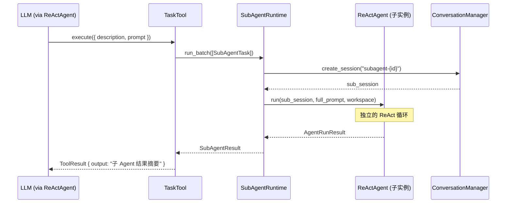
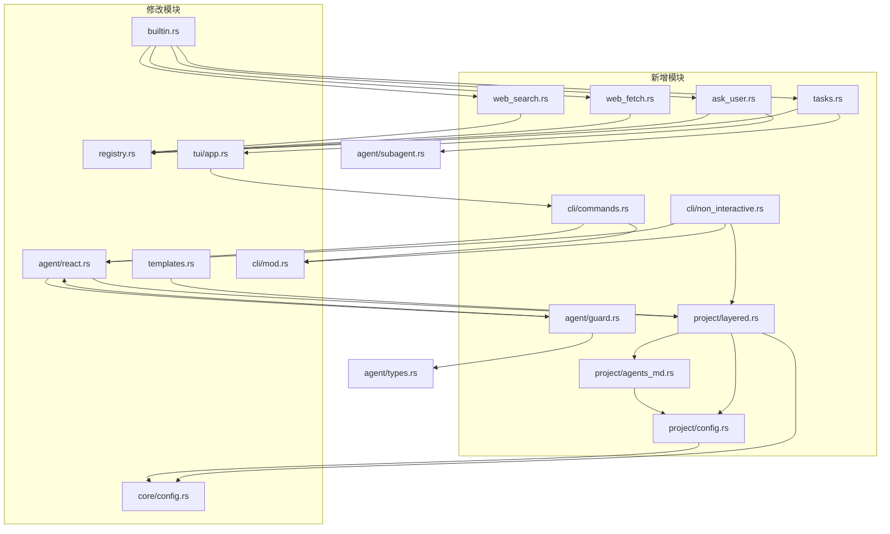
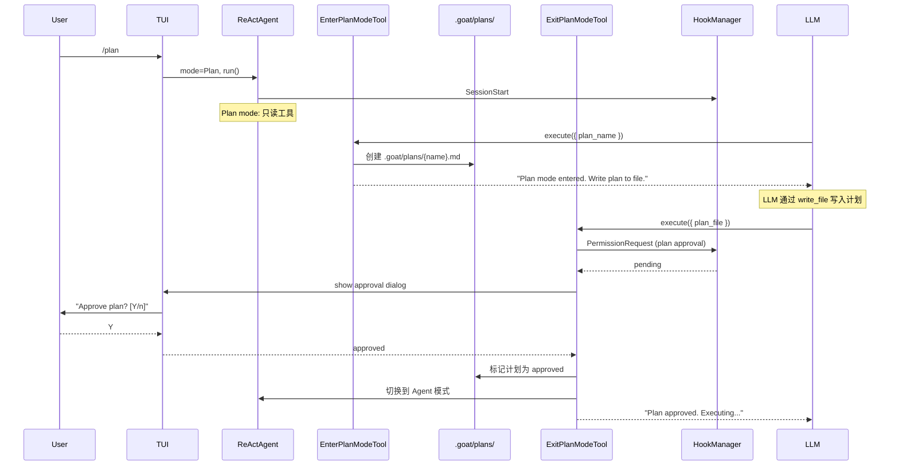
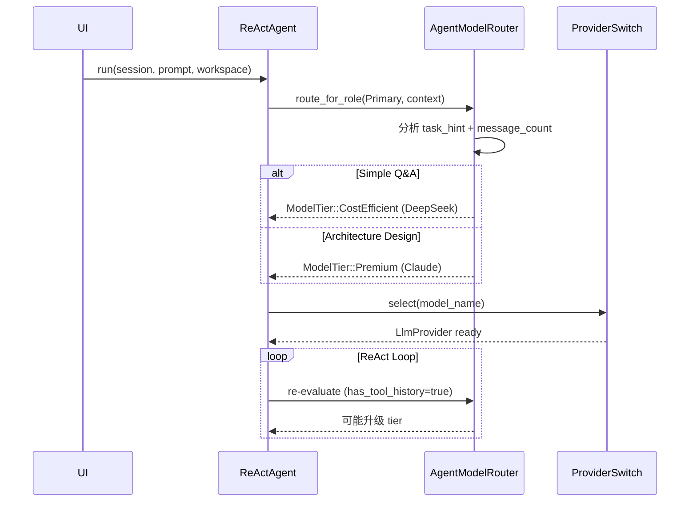
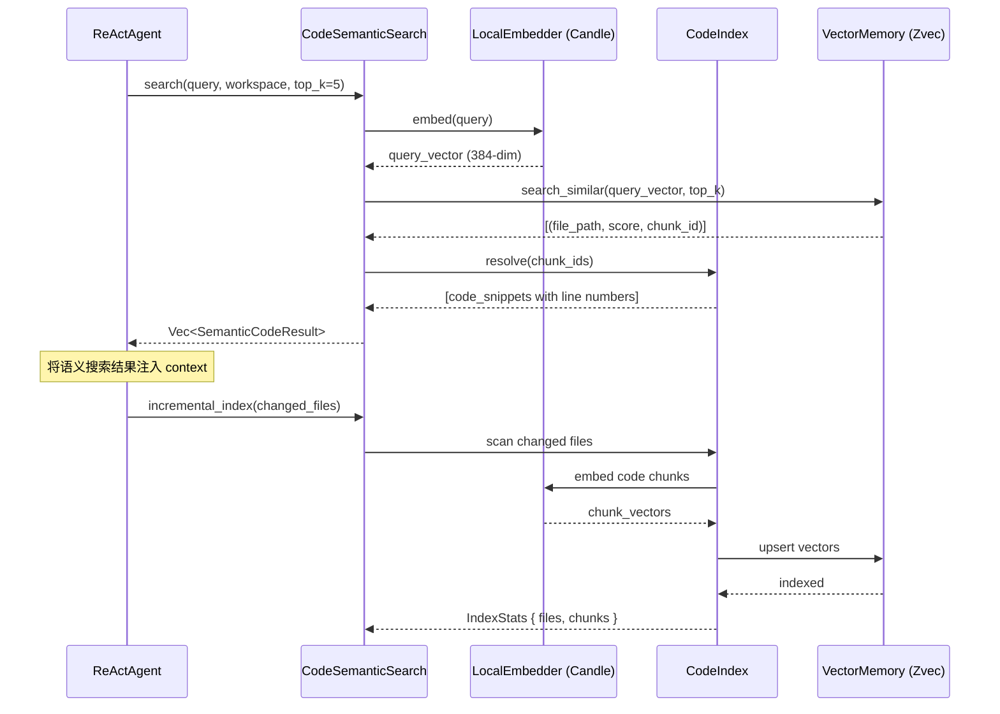
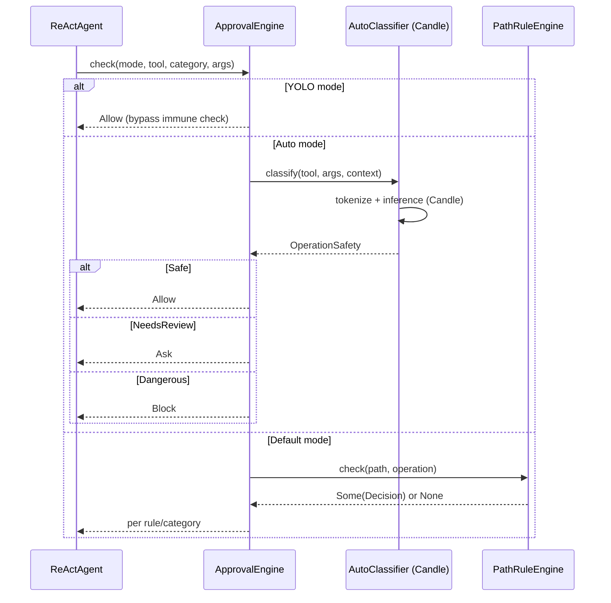
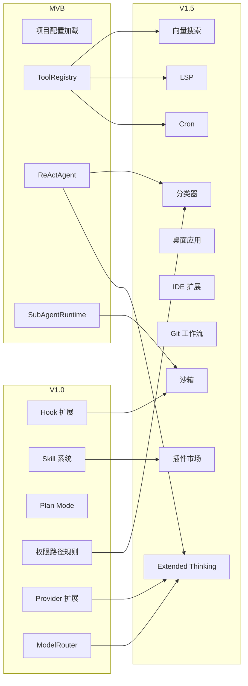
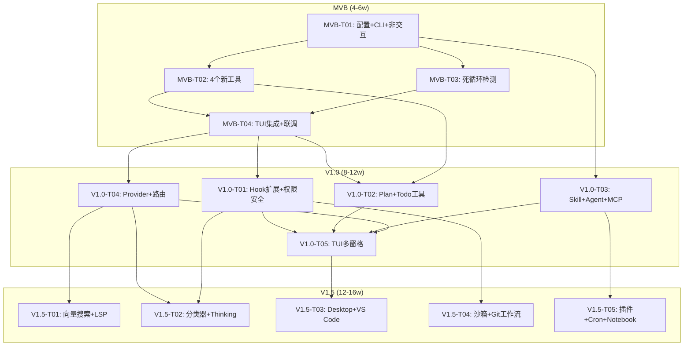

# goat_rust 升级路线图 — 架构设计与任务分解

> **Architect**: Bob  
> **基准文档**: `docs/competitive-benchmarking-report.md`  
> **日期**: 2026-07-07  
> **版本**: v1.0

---

## 目录

- [概述](#概述)
- [现有架构回顾](#现有架构回顾)
- [MVB 阶段](#mvb-阶段最小可用版本)
- [V1.0 阶段](#v10-阶段功能对齐)
- [V1.5 阶段](#v15-阶段超越竞品)
- [跨阶段依赖总图](#跨阶段依赖总图)

---

## 概述

本文档基于竞品对标分析报告，将 goat_rust 从当前状态（7 个工具、4 个 Hook 事件）分三个阶段升级至功能对齐并部分超越 OpenCode / Claude Code。

### 三阶段总览

| 阶段 | 目标 | 功能数 | 工具数 | 时间估算 |
|------|------|--------|--------|---------|
| **MVB** | 最小可用版本 | 7 项 | 12+ | 4-6 周 |
| **V1.0** | 功能对齐 OpenCode | 11 项 | 20+ | 8-12 周 |
| **V1.5** | 差异化超越 | 10 项 | 35+ | 12-16 周 |

### 关键设计原则

1. **最小侵入**: 优先在现有模块内扩展，避免大规模重构
2. **向后兼容**: 所有新增 API 不影响已有调用路径
3. **渐进增强**: 每个阶段可独立交付和测试
4. **Rust 原生**: 新依赖优先选择 Rust 生态原生 crate

---

## 现有架构回顾

### 当前模块拓扑

```
rgoat-core/
├── agent/          react.rs (ReAct 主循环), subagent.rs (并行调度),
│                   flow.rs (实现→审查→修复), types.rs (配置/事件)
├── provider/       provider.rs (LlmProvider trait), impls.rs (OpenAI/Anthropic),
│                   model_router.rs (三层路由，已定义但未集成), switch.rs
├── tools/          registry.rs (ToolRegistry), builtin.rs (7 个工具),
│                   retry.rs
├── security/       approval.rs (5 层审批链), sandbox.rs (存根)
├── conversation/   manager.rs (SQLite 持久化), compressor.rs (四层压缩),
│                   templates.rs (System Prompt 模板)
├── memory/         vector_store.rs (Zvec), embedding.rs (Candle),
│                   code_index.rs (语义索引)
├── mcp/            client.rs (StdioMcpClient), server.rs, types.rs
├── hooks/          mod.rs (4 个事件点)
├── core/           config.rs (Settings), event_bus.rs, cancellation.rs,
│                   paths.rs, workspace.rs, token_tracker.rs
├── review/         plan/ (mod.rs, types.rs, rules.rs, engine.rs, diff.rs)
├── cli/            mod.rs (parse_args, parse_interactive)
├── tasks/          mod.rs (TaskScheduler)
└── lib.rs
```

### 关键集成点

- **ReActAgent.run()**: 核心调用入口，`agent/react.rs` → `build_system_prompt()` → LLM → 工具执行
- **ToolRegistry**: 工具注册表，`tools/registry.rs`，通过 `create_builtin_tools()` 初始化
- **ApprovalEngine.check()**: 审批入口，`security/approval.rs`，5 层防御链
- **HookManager.run()**: 钩子入口，`hooks/mod.rs`，当前仅 4 个事件点
- **build_system_prompt()**: 提示词构建，`conversation/templates.rs`，已有 rules/skills 占位参数

---

## MVB 阶段（最小可用版本）

### MVB.1 架构设计

#### MVB.1.1 模块划分

```
MVB 新增/修改模块:
rgoat-core/src/
├── agent/
│   └── react.rs              [修改] 集成死循环检测、非交互模式入口
│   └── guard.rs              [新增] 死循环检测（ToolCallDeduper + 截断检测）
├── tools/
│   ├── registry.rs           [修改] 注册新工具
│   ├── builtin.rs            [修改] create_builtin_tools() 添加新工具
│   ├── web_search.rs         [新增] WebSearchTool
│   ├── web_fetch.rs          [新增] WebFetchTool
│   ├── ask_user.rs           [新增] AskUserQuestionTool
│   └── task.rs               [新增] TaskTool（LLM 可调用的子 Agent 创建工具）
├── project/
│   ├── mod.rs                [新增] 项目上下文模块入口
│   ├── config.rs             [新增] .goat/config.json 加载
│   ├── agents_md.rs          [新增] AGENTS.md 解析与加载
│   └── layered.rs            [新增] 分层配置（全局→项目→目录）
├── cli/
│   ├── mod.rs                [修改] 扩展 parse_args 支持非交互模式，斜杠命令注册
│   ├── commands.rs           [新增] 斜杠命令调度（/help /clear /model /compact /resume /plan）
│   └── non_interactive.rs    [新增] 非交互模式入口（`goat "任务"`）
├── core/
│   └── config.rs             [修改] Settings 增加项目配置字段
└── conversation/
    └── templates.rs          [修改] build_system_prompt 集成 AGENTS.md 规则
```

#### MVB.1.2 核心类型/接口设计

```rust
// ── WebSearch ──

/// Web 搜索 Provider trait（可替换后端）
#[async_trait]
pub trait SearchProvider: Send + Sync {
    /// 执行搜索，返回结果列表
    async fn search(&self, query: &str, max_results: usize) -> Result<Vec<SearchResult>, SearchError>;
    /// Provider 名称
    fn name(&self) -> &str;
}

#[derive(Debug, Clone, Serialize, Deserialize)]
pub struct SearchResult {
    pub title: String,
    pub url: String,
    pub snippet: String,
}

/// 默认实现：基于 DuckDuckGo Instant Answer API（无需 API key）
pub struct DuckDuckGoSearchProvider {
    client: reqwest::Client,
}

// ── WebFetch ──

/// 网页抓取器，带 15 分钟缓存
pub struct WebFetcher {
    client: reqwest::Client,
    cache: Cache<String, FetchedPage>,  // 15min TTL
}

#[derive(Debug, Clone)]
pub struct FetchedPage {
    pub url: String,
    pub title: String,
    pub markdown: String,    // HTML → Markdown 转换后
    pub fetched_at: chrono::DateTime<chrono::Utc>,
}

// ── AskUserQuestion ──

/// 向用户提问的工具（交互模式下弹出，非交互模式使用 CLI 参数）
pub struct AskUserQuestionTool {
    /// 回调：将问题发送给 UI 层并等待回答
    ask_callback: Arc<dyn Fn(AskQuestion) -> Pin<Box<dyn Future<Output = String> + Send>> + Send + Sync>,
}

#[derive(Debug, Clone, Serialize, Deserialize)]
pub struct AskQuestion {
    pub questions: Vec<QuestionItem>,
}

#[derive(Debug, Clone, Serialize, Deserialize)]
pub struct QuestionItem {
    pub question: String,
    pub header: String,
    pub options: Vec<QuestionOption>,
    pub multi_select: bool,
}

// ── TaskTool ──

/// LLM 可调用的子 Agent 创建工具
/// 与 SubAgentRuntime 集成：调用时创建 SubAgentTask 并执行
pub struct TaskTool {
    subagent_runtime: Arc<SubAgentRuntime>,
    session_id: String,
    workspace: String,
}

/// TaskTool 参数 JSON Schema:
/// {
///   "description": "简短描述（3-5 词）",
///   "prompt": "子 Agent 执行的完整任务描述",
///   "subagent_type": "general"  // 未来扩展
/// }

// ── 斜杠命令系统 ──

/// 斜杠命令注册表
pub struct CommandRegistry {
    commands: HashMap<String, Arc<dyn SlashCommand>>,
}

#[async_trait]
pub trait SlashCommand: Send + Sync {
    fn name(&self) -> &str;
    fn description(&self) -> &str;
    fn usage(&self) -> &str;
    async fn execute(&self, args: &[String], ctx: &CommandContext) -> CommandResult;
}

pub struct CommandContext {
    pub session_id: String,
    pub workspace: String,
    pub conversation: Arc<ConversationManager>,
    pub settings: Arc<Settings>,
    pub event_bus: Arc<EventBus>,
}

// ── AGENTS.md / .goat 配置 ──

/// 分层配置：全局 → 项目根 → 子目录
#[derive(Debug, Clone, Default, Serialize, Deserialize)]
pub struct ProjectConfig {
    /// 从 AGENTS.md 提取的规则列表
    pub rules: Vec<String>,
    /// .goat/config.json 内容
    pub settings: GoatProjectSettings,
    /// 加载来源路径
    pub source_path: PathBuf,
}

#[derive(Debug, Clone, Default, Serialize, Deserialize)]
pub struct GoatProjectSettings {
    /// 项目级 model 覆盖
    pub model: Option<String>,
    /// 项目级权限策略
    pub permissions: Option<HashMap<String, Decision>>,
    /// 忽略模式
    pub ignore_patterns: Vec<String>,
    /// 自定义命令
    pub commands: Option<Vec<CustomCommandDef>>,
}

/// 分层配置加载器
pub struct LayeredConfigLoader {
    /// 全局配置 (~/.goat/setting.json)
    global: Arc<Settings>,
}

impl LayeredConfigLoader {
    /// 按优先级加载：目录级 → 项目级 → 全局
    pub fn load_for_path(&self, workspace: &Path, current_dir: &Path) -> LayeredConfig {
        // 1. 从 workspace 根目录向上遍历，找 AGENTS.md + .goat/
        // 2. 从 current_dir 向上遍历，找额外的 AGENTS.md（目录级覆盖）
        // 3. 合并：目录级覆盖项目级覆盖全局
    }
}

// ── 死循环检测 ──

/// 死循环检测器
pub struct LoopGuard {
    /// 工具调用去重器：记录最近 N 次 (tool_name, args_hash)
    deduper: ToolCallDeduper,
    /// 截断检测：连续 N 步无进展
    consecutive_no_progress: usize,
    /// 配置
    config: LoopGuardConfig,
}

pub struct LoopGuardConfig {
    /// 最大连续相同工具调用次数
    pub max_duplicate_calls: usize,       // default: 3
    /// 最大连续无文件变更的步骤数
    pub max_no_progress_steps: usize,     // default: 10
    /// 去重窗口大小
    pub dedup_window: usize,              // default: 20
    /// 是否启用截断检测
    pub enable_truncation_detect: bool,   // default: true
}

impl LoopGuard {
    /// 在每次工具调用前调用，返回是否应该中断
    pub fn check(&mut self, tool_name: &str, args: &serde_json::Value) -> LoopDecision {
        // 1. 检查重复调用
        // 2. 检查无进展步数
        // 3. 检查输出截断（finish_reason == "length"）
    }
}

pub enum LoopDecision {
    /// 继续
    Continue,
    /// 警告（记录但继续）
    Warn(String),
    /// 中断（抛出 LoopDetected 错误）
    Break(String),
}
```

#### MVB.1.3 数据流：非交互模式执行

```mermaid
sequenceDiagram
    participant CLI as CLI (non_interactive.rs)
    participant Loader as LayeredConfigLoader
    participant Agent as ReActAgent
    participant Guard as LoopGuard
    participant Tools as ToolRegistry
    participant Conv as ConversationManager

    CLI->>Loader: load_for_path(workspace, cwd)
    Loader-->>CLI: LayeredConfig { rules, settings }
    CLI->>Conv: create_session()
    Conv-->>CLI: session_id
    CLI->>Agent: run(session_id, prompt, workspace)
    Note over Agent: build_system_prompt() with rules
    
    loop ReAct Loop (max_steps)
        Agent->>Guard: check(tool_name, args)
        alt LoopDetected
            Guard-->>Agent: Break(reason)
            Agent-->>CLI: AgentError::LoopDetected
        else Continue/Warn
            Guard-->>Agent: Continue
            Agent->>Tools: execute(name, args)
            Tools-->>Agent: ToolResult
        end
    end
    
    Agent-->>CLI: AgentRunResult { answer }
    CLI-->>CLI: print answer, exit
```



#### MVB.1.4 数据流：TaskTool 子 Agent 创建



### MVB.2 文件清单

```
[新增] rgoat-core/src/tools/web_search.rs          — WebSearchTool + DuckDuckGoSearchProvider
[新增] rgoat-core/src/tools/web_fetch.rs           — WebFetchTool + WebFetcher (15min cache)
[新增] rgoat-core/src/tools/ask_user.rs            — AskUserQuestionTool
[新增] rgoat-core/src/tools/task.rs                — TaskTool (SubAgentRuntime wrapper)
[新增] rgoat-core/src/agent/guard.rs               — LoopGuard + ToolCallDeduper
[新增] rgoat-core/src/project/mod.rs               — 项目上下文模块入口
[新增] rgoat-core/src/project/config.rs            — GoatProjectSettings + .goat/config.json 解析
[新增] rgoat-core/src/project/agents_md.rs         — AGENTS.md 查找/解析
[新增] rgoat-core/src/project/layered.rs           — LayeredConfigLoader 分层加载
[新增] rgoat-core/src/cli/commands.rs              — CommandRegistry + 7 个内置 SlashCommand
[新增] rgoat-core/src/cli/non_interactive.rs       — 非交互模式入口 run_once()
[修改] rgoat-core/src/tools/registry.rs            — 注册 WebSearch/WebFetch/AskUser/Task
[修改] rgoat-core/src/tools/builtin.rs             — create_builtin_tools() 增加 4 个新工具
[修改] rgoat-core/src/tools/mod.rs                 — pub mod 声明
[修改] rgoat-core/src/agent/react.rs               — 集成 LoopGuard、注入 ProjectConfig
[修改] rgoat-core/src/agent/mod.rs                 — pub mod guard
[修改] rgoat-core/src/cli/mod.rs                   — 扩展 parse_args，导出 CommandRegistry
[修改] rgoat-core/src/core/config.rs               — Settings 增加 project_config 相关字段
[修改] rgoat-core/src/conversation/templates.rs    — build_system_prompt 使用 project rules
[修改] rgoat-core/src/lib.rs                       — pub mod project, 新增 re-exports
[修改] rgoat-core/Cargo.toml                       — 新增依赖: scraper, html2text (或同功能)
[修改] rgoat-tui/src/app.rs                        — 斜杠命令委托给 CommandRegistry
```

### MVB.3 依赖关系

#### MVB.3.1 文件级依赖图



#### MVB.3.2 内部功能依赖

| 功能 | 依赖 |
|------|------|
| WebSearch/WebFetch | 无内部依赖 |
| AskUserQuestion | 需要 UI 回调机制（TUI 已有） |
| TaskTool | 依赖 SubAgentRuntime（已存在） |
| 斜杠命令系统 | 依赖 CommandRegistry + CLI 解析 |
| AGENTS.md 加载 | 依赖 LayeredConfigLoader |
| 非交互模式 | 依赖 LayeredConfigLoader + ReActAgent |
| 死循环检测 | 无内部依赖，插入 ReAct 循环 |

### MVB.4 任务列表

#### MVB-T01: 项目基础设施（配置 + 命令行 + 非交互入口）

| 属性 | 值 |
|------|---|
| **Task ID** | MVB-T01 |
| **任务描述** | 建立 MVB 阶段基础设施：新增 `project/` 模块（AGENTS.md/.goat 配置分层加载），扩展 CLI 支持斜杠命令系统和非交互模式。在 `Cargo.toml` 中声明新依赖。 |
| **涉及文件** | `Cargo.toml`, `src/project/mod.rs`, `src/project/config.rs`, `src/project/agents_md.rs`, `src/project/layered.rs`, `src/cli/mod.rs`, `src/cli/commands.rs`, `src/cli/non_interactive.rs`, `src/core/config.rs`, `src/lib.rs` |
| **依赖** | 无 |
| **优先级** | P0 |
| **复杂度** | 中等 |

#### MVB-T02: 核心工具实现（WebSearch + WebFetch + AskUser + TaskTool）

| 属性 | 值 |
|------|---|
| **Task ID** | MVB-T02 |
| **任务描述** | 实现 4 个新工具：WebSearchTool（DuckDuckGo）、WebFetchTool（reqwest + HTML→Markdown + 15分钟缓存）、AskUserQuestionTool（TUI 回调集成）、TaskTool（SubAgentRuntime 包装）。在 builtin.rs 和 registry.rs 中注册。 |
| **涉及文件** | `src/tools/web_search.rs`, `src/tools/web_fetch.rs`, `src/tools/ask_user.rs`, `src/tools/task.rs`, `src/tools/builtin.rs`, `src/tools/registry.rs`, `src/tools/mod.rs` |
| **依赖** | MVB-T01 |
| **优先级** | P0 |
| **复杂度** | 中等 |

#### MVB-T03: 死循环检测 + Agent 循环增强

| 属性 | 值 |
|------|---|
| **Task ID** | MVB-T03 |
| **任务描述** | 实现 LoopGuard（ToolCallDeduper + 截断检测 + 无进展检测），集成到 ReActAgent.run() 主循环中。修改 templates.rs 使 system prompt 注入项目 rules。 |
| **涉及文件** | `src/agent/guard.rs`, `src/agent/react.rs`, `src/agent/mod.rs`, `src/agent/types.rs`, `src/conversation/templates.rs` |
| **依赖** | MVB-T01 |
| **优先级** | P0 |
| **复杂度** | 简单 |

#### MVB-T04: TUI 斜杠命令集成 + 端到端联调

| 属性 | 值 |
|------|---|
| **Task ID** | MVB-T04 |
| **任务描述** | TUI app.rs 中将斜杠命令委托给 CommandRegistry；非交互模式完整流程打通；所有新增工具通过集成测试验证。 |
| **涉及文件** | `rgoat-tui/src/app.rs`, `src/cli/non_interactive.rs`, `src/cli/commands.rs`, `tests/mvb_integration.rs` |
| **依赖** | MVB-T02, MVB-T03 |
| **优先级** | P1 |
| **复杂度** | 简单 |

### MVB.5 关键设计决策

| # | 决策 | 理由 |
|---|------|------|
| 1 | **WebSearch 使用 DuckDuckGo Instant Answer API** | 免费、无需 API key、Rust 生态有 `duckduckgo` crate 或直接 HTTP 调用。备选：SerpAPI（需 key，供高级用户） |
| 2 | **WebFetch HTML→MD 使用 `scraper` + 自写转换** | `scraper` 是 Rust 最成熟的 HTML 解析器（CSS selector），配合简单的 HTML→Markdown 转换逻辑。避免引入重量级依赖。15分钟缓存使用 `moka` 或简单 HashMap + TTL。 |
| 3 | **TaskTool 复用 SubAgentRuntime** | SubAgentRuntime 已有并行调度 + 深度限制 + 会话隔离。TaskTool 只需 JSON 参数 → SubAgentTask 转换。 |
| 4 | **斜杠命令使用 trait-based 注册表** | `SlashCommand` trait + `CommandRegistry` HashMap，与 Tool trait 模式一致，方便未来添加自定义命令。 |
| 5 | **AGENTS.md 加载时机** | 在会话创建时加载一次（`LayeredConfigLoader::load_for_path`），结果缓存到会话上下文。不每次 ReAct 循环重新加载。 |
| 6 | **分层配置优先级** | 目录 `.goat/` > 项目根 `.goat/` > `~/.goat/setting.json`。AGENTS.md 按距离当前目录最近者优先。 |
| 7 | **死循环检测策略** | 参考 OpenCode `doom_loop`：连续 3 次相同 (tool, args_hash) → Break；连续 10 步无文件变更 → Warning → Break；`finish_reason="length"` 连续 3 次 → Break。 |
| 8 | **不新增外部依赖 crate** | WebSearch/Fetch 复用已有 `reqwest`；HTML 解析用 `scraper`（轻量）；缓存用内存 HashMap + TTL。不引入重量级新依赖。 |

---

## V1.0 阶段（功能对齐）

### V1.0.1 架构设计

#### V1.0.1.1 模块划分

```
V1.0 新增/修改模块:
rgoat-core/src/
├── agent/
│   ├── plan_mode.rs           [新增] EnterPlanMode/ExitPlanMode 工具 + 审批流
│   └── reactor.rs             [修改] 注入 Skill 指令、路由模型
├── tools/
│   ├── todo_write.rs          [新增] TodoWriteTool
│   ├── todo_read.rs           [新增] TodoReadTool
│   └── plan_tools.rs          [新增] EnterPlanModeTool + ExitPlanModeTool
├── skills/
│   ├── mod.rs                 [新增] Skill 系统入口
│   ├── loader.rs              [新增] SKILL.md 文件加载（从 .goat/skills/ 目录）
│   ├── registry.rs            [新增] SkillRegistry: 注册 Skill 为工具
│   └── types.rs               [新增] Skill 数据结构
├── project/
│   ├── agent_def.rs           [新增] .goat/agents/*.toml 自定义 Agent 定义
│   └── mcp_loader.rs          [新增] .goat/mcp.json 自动 MCP 配置加载
├── hooks/
│   ├── mod.rs                 [修改] HookPoint 从 4 个扩展到 14 个
│   ├── events.rs              [新增] 完整 HookEvent 枚举（对标 Claude Code 30 事件）
│   └── builtin_hooks.rs       [新增] 内置 Hook（SessionStart/End, Stop, PreCompact 等）
├── security/
│   ├── path_rules.rs          [新增] glob 匹配的权限路径规则
│   └── protected_paths.rs     [新增] 受保护路径机制（.env/.git 等自动保护）
├── provider/
│   ├── gemini.rs              [新增] Gemini Provider（Google AI Studio API）
│   ├── ollama.rs              [新增] Ollama 本地模型 Provider
│   └── model_router.rs        [修改] 集成到 ReAct 循环，按 Agent 角色/任务路由
├── tui/
│   (在 rgoat-tui crate 中实现)
│   ├── src/app.rs             [修改] 多窗格布局（消息 + 文件树 + 状态栏）
│   ├── src/panels/            [新增] 面板子模块
│   │   ├── chat.rs            [新增] 消息面板
│   │   ├── file_tree.rs       [新增] 文件树/Diff 面板
│   │   ├── status.rs          [新增] 状态栏
│   │   └── input.rs           [新增] 输入面板
│   └── src/theme.rs           [新增] 主题系统
└── core/
    └── protected.rs           [新增] 受保护路径定义和检查
```

#### V1.0.1.2 核心类型/接口设计

```rust
// ── Skill 系统 ──

/// SKILL.md 解析后的 Skill 定义
#[derive(Debug, Clone, Serialize, Deserialize)]
pub struct Skill {
    /// Skill 名称（从文件名推导）
    pub name: String,
    /// SKILL.md 中的 description 字段
    pub description: String,
    /// 触发条件（何时自动激活此 Skill）
    pub trigger: Option<SkillTrigger>,
    /// Skill 提供的工具定义
    pub tools: Vec<SkillToolDef>,
    /// 注入到 System Prompt 的指令
    pub system_prompt: String,
    /// 来源文件路径
    pub source_path: PathBuf,
}

#[derive(Debug, Clone, Serialize, Deserialize)]
pub struct SkillTrigger {
    /// 基于关键词自动触发
    pub keywords: Vec<String>,
    /// 基于文件模式触发
    pub file_patterns: Vec<String>,
}

/// SKILL.md 文件格式（Front Matter YAML + Markdown body）
/// ---
/// description: "PDF processing skill"
/// trigger:
///   keywords: ["pdf", "document"]
///   file_patterns: ["*.pdf"]
/// tools:
///   - pdf_to_text
///   - pdf_to_images
/// ---
/// # PDF Skill
/// (system prompt content...)

pub struct SkillLoader;

impl SkillLoader {
    /// 从 .goat/skills/ 目录加载所有 SKILL.md 文件
    pub fn load_from_dir(dir: &Path) -> Result<Vec<Skill>, SkillError>;
    /// 解析单个 SKILL.md 文件（YAML front matter + Markdown body）
    pub fn parse_skill_md(content: &str, source: &Path) -> Result<Skill, SkillError>;
}

/// Skill 注册表：将 Skill 的工具注入 ToolRegistry
pub struct SkillRegistry {
    skills: HashMap<String, Skill>,
}

impl SkillRegistry {
    pub fn register_skill(&mut self, skill: Skill);
    /// 将 Skill 的工具注册到 ToolRegistry（名称加 `skill_{skill_name}_{tool_name}` 前缀）
    pub fn register_tools(&self, tool_registry: &mut ToolRegistry);
    /// 获取所有 Skill 的 system prompt 合并
    pub fn system_prompts(&self) -> String;
}

// ── Plan Mode 完整实现 ──

/// EnterPlanMode 工具
pub struct EnterPlanModeTool {
    event_bus: Arc<EventBus>,
}

/// ExitPlanMode 工具（带审批）
pub struct ExitPlanModeTool {
    event_bus: Arc<EventBus>,
    plan_dir: PathBuf,  // .goat/plans/
}

/// Plan 审批状态
#[derive(Debug, Clone, PartialEq, Eq)]
pub enum PlanApprovalStatus {
    /// 等待用户审批
    Pending,
    /// 已批准
    Approved,
    /// 已拒绝
    Rejected(String),
}

/// Plan 模式状态机
pub struct PlanModeState {
    status: PlanApprovalStatus,
    /// 计划文件路径
    plan_file: PathBuf,
    /// 计划内容
    plan_content: String,
    /// 计划生成的步骤列表
    steps: Vec<PlanStep>,
}

#[derive(Debug, Clone, Serialize, Deserialize)]
pub struct PlanStep {
    pub step_number: usize,
    pub description: String,
    pub files_to_change: Vec<String>,
    pub risks: Vec<String>,
}

// ── TodoWrite / TodoRead ──

/// Todo 条目
#[derive(Debug, Clone, Serialize, Deserialize)]
pub struct TodoItem {
    pub id: String,
    pub content: String,
    pub status: TodoStatus,
    pub priority: TodoPriority,
}

#[derive(Debug, Clone, Serialize, Deserialize)]
pub enum TodoStatus {
    Pending,
    InProgress,
    Completed,
    Cancelled,
}

pub struct TodoWriteTool {
    /// Todo 存储（会话级别，内存 + 可选持久化）
    store: Arc<Mutex<Vec<TodoItem>>>,
}

pub struct TodoReadTool {
    store: Arc<Mutex<Vec<TodoItem>>>,
}

// ── 权限路径规则 ──

/// 权限路径规则（glob 匹配）
#[derive(Debug, Clone, Serialize, Deserialize)]
pub struct PathRule {
    /// glob 模式（如 "*.env*", "**/secrets/**"）
    pub pattern: String,
    /// 操作类型
    pub operation: PathOperation,
    /// 决策
    pub decision: Decision,
}

#[derive(Debug, Clone, Copy, PartialEq, Eq, Serialize, Deserialize)]
pub enum PathOperation {
    Read,
    Write,
    Execute,
    Any,
}

/// 权限路径规则引擎
pub struct PathRuleEngine {
    rules: Vec<PathRule>,
    /// 编译后的 glob Patterns
    compiled: Vec<(glob::Pattern, PathOperation, Decision)>,
}

impl PathRuleEngine {
    pub fn new() -> Self;
    pub fn add_rule(&mut self, rule: PathRule);
    /// 检查路径是否匹配规则
    pub fn check(&self, path: &Path, operation: PathOperation) -> Option<Decision>;
}

// ── Gemini Provider ──

pub struct GeminiProvider {
    config: ProviderConfig,
    client: reqwest::Client,
}

/// Gemini API:
/// POST https://generativelanguage.googleapis.com/v1beta/models/{model}:generateContent
/// System instruction 通过 system_instruction 字段
/// Tools 通过 tools 字段（Gemini function calling 格式）

// ── Ollama Provider ──

pub struct OllamaProvider {
    config: ProviderConfig,  // base_url = "http://localhost:11434/v1" (OpenAI-compatible API)
    client: reqwest::Client,
}

/// Ollama 自带 OpenAI-compatible API (/v1/chat/completions)
/// 直接复用 OpenAiCompatibleProvider 或以 base_url 指向 Ollama

// ── 模型路由集成 ──

/// 增强的 ModelRouter，按 Agent 角色路由
pub struct AgentModelRouter {
    router: ModelRouter,
    /// 角色 → 模型层级映射
    role_routing: HashMap<AgentRole, ModelTier>,
}

#[derive(Debug, Clone, PartialEq, Eq, Hash)]
pub enum AgentRole {
    /// 主 Agent
    Primary,
    /// 子 Agent（可更低成本）
    SubAgent,
    /// 审查 Agent（需高质量）
    Reviewer,
    /// Plan 模式 Agent
    Plan,
}

impl AgentModelRouter {
    /// 为指定角色选择模型
    pub fn route_for_role(&self, role: AgentRole, context: &RoutingContext) -> &ProviderConfig;
}

// ── Hook 事件扩展 ──

/// 扩展后的 Hook 事件（对标 Claude Code 30 事件）
#[derive(Debug, Clone, Copy, PartialEq, Eq, Hash)]
pub enum HookEvent {
    // 原有
    PreToolUse,
    PostToolUse,
    PreMessage,
    OnFinish,
    
    // 新增 10 个关键事件
    SessionStart,         // 会话创建时
    SessionEnd,           // 会话结束时
    UserPromptSubmit,     // 用户提交提示时
    Stop,                 // Agent 停止时
    PreCompact,           // 上下文压缩前
    PostCompact,          // 上下文压缩后
    SubagentStart,        // 子 Agent 启动
    SubagentStop,         // 子 Agent 完成
    PermissionRequest,    // 权限请求时
    Notification,         // 通知事件
}

/// 新的 Hook trait（更丰富的上下文）
#[async_trait]
pub trait HookV2: Send + Sync {
    fn name(&self) -> &str;
    /// 监听的事件列表
    fn events(&self) -> Vec<HookEvent>;
    /// 执行钩子
    async fn run(&self, event: HookEvent, ctx: &HookContextV2) -> Result<Option<String>, HookError>;
}

pub struct HookContextV2 {
    pub event: HookEvent,
    pub session_id: Option<String>,
    pub tool_name: Option<String>,
    pub arguments: Option<serde_json::Value>,
    pub result: Option<serde_json::Value>,
    pub message: Option<String>,
    pub permission_request: Option<PermissionRequestContext>,
}

// ── MCP 自动配置 ──

/// .goat/mcp.json 格式
/// {
///   "mcpServers": {
///     "server-name": {
///       "command": "npx",
///       "args": ["-y", "@modelcontextprotocol/server-name"]
///     }
///   }
/// }

pub struct McpConfigLoader;

impl McpConfigLoader {
    /// 从 .goat/mcp.json 加载 MCP 服务器配置
    pub fn load(workspace: &Path) -> Result<Vec<McpServerConfig>, McpConfigError>;
    /// 自动连接并注册所有 MCP 工具
    pub async fn auto_connect(
        configs: Vec<McpServerConfig>,
        registry: &mut ToolRegistry,
    ) -> Result<Vec<Arc<dyn McpClient>>, McpConfigError>;
}

// ── 自定义 Agent 定义 ──

/// .goat/agents/{name}.toml 格式
#[derive(Debug, Clone, Serialize, Deserialize)]
pub struct AgentDefinition {
    pub name: String,
    pub description: String,
    pub model: Option<String>,
    pub system_prompt: String,
    pub tools: Vec<String>,       // 允许使用的工具白名单
    pub max_steps: Option<usize>,
    pub temperature: Option<f64>,
}

pub struct AgentDefinitionLoader;

impl AgentDefinitionLoader {
    pub fn load_from_dir(dir: &Path) -> Result<Vec<AgentDefinition>, AgentDefError>;
}
```

#### V1.0.1.3 数据流：Plan Mode 全流程



#### V1.0.1.4 数据流：模型路由决策



### V1.0.2 文件清单

```
[新增] rgoat-core/src/skills/mod.rs              — Skill 系统入口
[新增] rgoat-core/src/skills/loader.rs           — SKILL.md 加载+YAML解析
[新增] rgoat-core/src/skills/registry.rs         — SkillRegistry
[新增] rgoat-core/src/skills/types.rs            — Skill/SkillTrigger 类型
[新增] rgoat-core/src/tools/todo_write.rs        — TodoWriteTool
[新增] rgoat-core/src/tools/todo_read.rs         — TodoReadTool
[新增] rgoat-core/src/tools/plan_tools.rs        — EnterPlanModeTool + ExitPlanModeTool
[新增] rgoat-core/src/agent/plan_mode.rs         — PlanModeState 状态机
[新增] rgoat-core/src/hooks/events.rs            — HookEvent 枚举 + HookV2 trait
[新增] rgoat-core/src/hooks/builtin_hooks.rs     — 内置 Hook 实现（10 个）
[新增] rgoat-core/src/security/path_rules.rs     — PathRuleEngine（glob 匹配）
[新增] rgoat-core/src/security/protected_paths.rs — 受保护路径检测
[新增] rgoat-core/src/provider/gemini.rs         — GeminiProvider
[新增] rgoat-core/src/provider/ollama.rs         — OllamaProvider
[新增] rgoat-core/src/project/agent_def.rs       — AgentDefinitionLoader
[新增] rgoat-core/src/project/mcp_loader.rs      — McpConfigLoader
[新增] rgoat-core/src/core/protected.rs          — 受保护路径列表
[新增] rgoat-tui/src/panels/chat.rs              — 消息面板
[新增] rgoat-tui/src/panels/file_tree.rs         — 文件树/Diff 面板
[新增] rgoat-tui/src/panels/status.rs            — 状态栏面板
[新增] rgoat-tui/src/panels/input.rs             — 输入面板
[新增] rgoat-tui/src/theme.rs                    — 主题系统
[修改] rgoat-core/src/hooks/mod.rs               — HookManager 升级到 V2
[修改] rgoat-core/src/tools/registry.rs          — 注册 TodoWrite/Read, Plan 工具
[修改] rgoat-core/src/tools/builtin.rs           — create_builtin_tools() 更新
[修改] rgoat-core/src/tools/mod.rs               — pub mod 声明
[修改] rgoat-core/src/agent/react.rs             — 集成 Skill 指令、ModelRouter
[修改] rgoat-core/src/agent/mod.rs               — pub mod plan_mode
[修改] rgoat-core/src/agent/subagent.rs          — 触发 SubagentStart/Stop Hook
[修改] rgoat-core/src/agent/types.rs             — AgentConfig 增加 role 字段
[修改] rgoat-core/src/security/approval.rs       — 集成 PathRuleEngine
[修改] rgoat-core/src/security/mod.rs            — pub mod path_rules, protected_paths
[修改] rgoat-core/src/provider/mod.rs            — pub mod gemini, ollama
[修改] rgoat-core/src/provider/model_router.rs   — 增加 AgentModelRouter
[修改] rgoat-core/src/conversation/templates.rs  — 注入 Skill prompts
[修改] rgoat-core/src/conversation/compressor.rs — 触发 PreCompact/PostCompact hooks
[修改] rgoat-core/src/lib.rs                     — pub mod skills, 新 re-exports
[修改] rgoat-core/Cargo.toml                     — 新增: yaml-rust2, 可能需要 tower-http
[修改] rgoat-tui/src/app.rs                      — 多窗格布局重构
[修改] rgoat-tui/Cargo.toml                      — 可能新增 tui-tree-widget
[修改] rgoat-tui/src/main.rs                     — 集成新面板
```

### V1.0.3 依赖关系

#### V1.0.3.1 文件级依赖图

```mermaid
graph TD
    subgraph "Skill 系统"
        skill_types[skills/types.rs]
        skill_loader[skills/loader.rs]
        skill_registry[skills/registry.rs]
        skill_mod[skills/mod.rs]
    end
    
    subgraph "Plan Mode"
        plan_tools[tools/plan_tools.rs]
        plan_mode[agent/plan_mode.rs]
    end
    
    subgraph "Hook 扩展"
        hook_events[hooks/events.rs]
        builtin_hooks[hooks/builtin_hooks.rs]
        hook_mod[hooks/mod.rs]
    end
    
    subgraph "Provider"
        gemini[provider/gemini.rs]
        ollama[provider/ollama.rs]
        model_router[provider/model_router.rs]
    end
    
    subgraph "Security"
        path_rules[security/path_rules.rs]
        protected_paths[security/protected_paths.rs]
        core_protected[core/protected.rs]
    end
    
    subgraph "Project"
        agent_def[project/agent_def.rs]
        mcp_loader[project/mcp_loader.rs]
    end
    
    subgraph "TUI Panels"
        chat[panels/chat.rs]
        file_tree[panels/file_tree.rs]
        status[panels/status.rs]
        input[panels/input.rs]
        theme[theme.rs]
    end
    
    skill_loader --> skill_types
    skill_registry --> skill_types
    skill_registry --> registry[tools/registry.rs]
    plan_tools --> plan_mode
    plan_tools --> registry
    plan_mode --> event_bus[core/event_bus.rs]
    hook_events --> hook_mod
    builtin_hooks --> hook_events
    gemini --> provider_trait[provider/provider.rs]
    ollama --> provider_trait
    model_router --> provider_trait
    path_rules --> approval[security/approval.rs]
    protected_paths --> core_protected
    agent_def --> project_config[project/config.rs]
    mcp_loader --> mcp_client[mcp/client.rs]
    mcp_loader --> registry
    chat --> app[rgoat-tui/app.rs]
    file_tree --> app
    status --> app
    input --> app
```



#### V1.0.3.2 跨阶段依赖

| V1.0 功能 | 依赖 MVB 功能 |
|-----------|-------------|
| Skill 系统 | AGENTS.md 加载框架（扩展 SKILL.md 解析） |
| TodoWrite/Read 工具 | ToolRegistry（纯新增，无依赖） |
| Hook 事件扩展 | HookManager（重构现有） |
| Plan Mode 完整流程 | AgentMode::Plan（已存在）+ 斜杠命令系统 |
| 权限路径规则 | ApprovalEngine（扩展 PathRuleEngine） |
| Provider 扩展 | ProviderConfig（已有） |
| 模型路由 | ModelRouter（已存在但未集成） |
| TUI 完成 | 斜杠命令系统（MVB-T04） |
| 自定义 Agent | AGENTS.md 加载框架 |
| MCP 自动配置 | 项目配置加载（MVB-T01） |
| 受保护路径 | 权限路径规则（同阶段） |

### V1.0.4 任务列表

#### V1.0-T01: Hook 扩展 + 权限安全基础设施

| 属性 | 值 |
|------|---|
| **Task ID** | V1.0-T01 |
| **任务描述** | 扩展 Hook 系统从 4 个事件到 14 个关键事件（对标 Claude Code 30 事件的子集）。实现 HookV2 trait + HookManagerV2。实现权限路径规则引擎（glob 匹配）+ 受保护路径机制（.env/.git 等自动保护）。更新 Cargo.toml 依赖。 |
| **涉及文件** | `src/hooks/mod.rs`, `src/hooks/events.rs`, `src/hooks/builtin_hooks.rs`, `src/security/path_rules.rs`, `src/security/protected_paths.rs`, `src/security/mod.rs`, `src/security/approval.rs`, `src/core/protected.rs`, `Cargo.toml` |
| **依赖** | 无（仅依赖 MVB 完成的 HookManager 基础） |
| **优先级** | P0 |
| **复杂度** | 中等 |

#### V1.0-T02: Plan Mode 完整实现 + TodoWrite/Read 工具

| 属性 | 值 |
|------|---|
| **Task ID** | V1.0-T02 |
| **任务描述** | 实现 EnterPlanModeTool + ExitPlanModeTool + PlanModeState 状态机 + 计划文件读写（.goat/plans/*.md）+ 审批流。实现 TodoWriteTool + TodoReadTool。集成到 Agent 循环和 TUI。 |
| **涉及文件** | `src/tools/plan_tools.rs`, `src/agent/plan_mode.rs`, `src/tools/todo_write.rs`, `src/tools/todo_read.rs`, `src/tools/registry.rs`, `src/tools/builtin.rs`, `src/tools/mod.rs`, `src/agent/react.rs`, `rgoat-tui/src/app.rs` |
| **依赖** | MVB-T02（ToolRegistry 基础设施）, MVB-T04（斜杠命令） |
| **优先级** | P0 |
| **复杂度** | 复杂 |

#### V1.0-T03: Skill 系统 + 自定义 Agent + MCP 自动配置

| 属性 | 值 |
|------|---|
| **Task ID** | V1.0-T03 |
| **任务描述** | 实现完整的 Skill 系统：SKILL.md YAML front matter 解析、SkillRegistry、工具注册（自动前缀命名）。实现 .goat/agents/*.toml 自定义 Agent 定义加载。实现 .goat/mcp.json 自动 MCP 配置加载和连接。 |
| **涉及文件** | `src/skills/mod.rs`, `src/skills/types.rs`, `src/skills/loader.rs`, `src/skills/registry.rs`, `src/project/agent_def.rs`, `src/project/mcp_loader.rs`, `src/tools/registry.rs`, `src/conversation/templates.rs`, `src/lib.rs` |
| **依赖** | MVB-T01（项目配置框架）, V1.0-T01（Hook 扩展用于 Skill 生命周期） |
| **优先级** | P0 |
| **复杂度** | 复杂 |

#### V1.0-T04: Provider 扩展 + 模型路由集成

| 属性 | 值 |
|------|---|
| **Task ID** | V1.0-T04 |
| **任务描述** | 实现 GeminiProvider（Google AI Studio API，OpenAI 兼容 + Gemini 原生格式自适应）。实现 OllamaProvider（复用 OpenAI-compatible，指向 localhost:11434）。将 ModelRouter 集成到 ReActAgent 循环中，实现 AgentModelRouter 按角色路由。更新 ProviderSwitch 支持新 provider。 |
| **涉及文件** | `src/provider/gemini.rs`, `src/provider/ollama.rs`, `src/provider/model_router.rs`, `src/provider/mod.rs`, `src/provider/switch.rs`, `src/agent/react.rs`, `src/agent/types.rs`, `src/core/config.rs` |
| **依赖** | MVB 完成（ReActAgent 稳定） |
| **优先级** | P1 |
| **复杂度** | 中等 |

#### V1.0-T05: TUI 多窗格重构 + 端到端集成

| 属性 | 值 |
|------|---|
| **Task ID** | V1.0-T05 |
| **任务描述** | 重构 rgoat-tui 为多窗格布局：消息面板 + 文件树/Diff 面板 + 状态栏 + 输入面板。集成主题系统。将所有 V1.0 功能端到端联调打通（Plan 审批 UI、Todo 列表显示、Skill 状态提示等）。 |
| **涉及文件** | `rgoat-tui/src/app.rs`, `rgoat-tui/src/panels/chat.rs`, `rgoat-tui/src/panels/file_tree.rs`, `rgoat-tui/src/panels/status.rs`, `rgoat-tui/src/panels/input.rs`, `rgoat-tui/src/theme.rs`, `rgoat-tui/src/main.rs`, `rgoat-tui/Cargo.toml` |
| **依赖** | V1.0-T02, V1.0-T03, V1.0-T04 |
| **优先级** | P1 |
| **复杂度** | 复杂 |

### V1.0.5 关键设计决策

| # | 决策 | 理由 |
|---|------|------|
| 1 | **Skill 工具命名**: `skill_{skill_name}_{tool_name}` | 避免与内置工具/其他 Skill 冲突，LLM 可通过前缀识别来源 |
| 2 | **SKILL.md 用 YAML front matter** | 对标 OpenCode 和 Claude Code 的 Markdown 格式，YAML 解析用 `serde_yaml` |
| 3 | **Plan Mode 文件格式**: `.goat/plans/{name}.md` | 对标 OpenCode 路径约定，Plain Markdown 可被任何编辑器打开 |
| 4 | **Ollama 集成策略**: 复用 OpenAI-compatible API | Ollama v0.2+ 原生支持 `/v1/chat/completions`，无需独立 Provider 实现。只需 config 模板 + base_url 指向 localhost |
| 5 | **Gemini 集成策略**: 新 Provider，但优先尝试 OpenAI-compatible 端点 | Gemini 有 `/v1beta/openai/chat/completions` 兼容端点，但 function calling 格式有差异。先用 OpenAI-compatible 路径，fallback 到 Gemini 原生 API |
| 6 | **模型路由触发时机**: ReAct 循环开始时 + 每 N 步重评估 | 开始根据角色/任务设定初始 tier，每 5 步检查是否需要升降级（消息量、工具调用复杂度） |
| 7 | **Hook 事件不追求 30 个全覆盖** | Claude Code 的 30 个事件包含部分高度专用的（如 `PreToolUse.extended`）。V1.0 先实现 14 个最关键的，其余在 V1.5 按需添加 |
| 8 | **TUI 面板拆分遵循单一职责** | chat / file_tree / status / input 四个独立面板，每个有自己的渲染逻辑，通过 App 状态协调 |

---

## V1.5 阶段（超越竞品）

### V1.5.1 架构设计

#### V1.5.1.1 模块划分

```
V1.5 新增/修改模块:
rgoat-core/src/
├── memory/
│   ├── vector_store.rs       [修改] Zvec 集成到代码搜索管道
│   ├── embedding.rs          [修改] Candle 本地嵌入管线完善
│   ├── code_index.rs         [修改] 增量索引 + 自动更新
│   └── search.rs             [新增] 统一语义搜索接口
├── lsp/
│   ├── mod.rs                [新增] LSP 集成模块
│   ├── client.rs             [新增] LSP 客户端（基于 tower-lsp）
│   ├── diagnostics.rs        [新增] 诊断信息获取
│   ├── completion.rs         [新增] 补全结果获取
│   └── symbols.rs            [新增] 文档符号查询
├── classifier/
│   ├── mod.rs                [新增] 自动模式分类器
│   ├── model.rs              [新增] Candle 推理管线
│   └── safety.rs             [新增] 操作安全性判断
├── sandbox/
│   ├── mod.rs                [新增] 沙箱模块入口
│   ├── docker.rs             [新增] Docker 沙箱集成
│   └── worktree.rs           [新增] Git Worktree 隔离
├── cron/
│   ├── mod.rs                [新增] 定时任务/Routine 系统
│   ├── scheduler.rs          [新增] Cron 调度器
│   └── routine.rs            [新增] Routine 定义和执行
├── plugins/
│   ├── mod.rs                [新增] 插件市场模块
│   ├── wasm_runtime.rs       [新增] WASM 运行时（wasmtime）
│   ├── manifest.rs           [新增] 插件清单解析
│   └── registry.rs           [新增] 插件注册表
├── git/
│   ├── mod.rs                [新增] Git 工作流自动化
│   ├── auto_commit.rs        [新增] 自动 commit
│   ├── pr.rs                 [新增] PR 创建（GitHub/GitLab API）
│   └── changelog.rs          [新增] 自动 Changelog 生成
├── provider/
│   ├── model_router.rs       [修改] 增加 Extended Thinking 参数
│   └── thinking.rs           [新增] Extended Thinking 参数透传
└── tools/
    ├── cron_tools.rs         [新增] CronCreate/Delete/List 工具
    ├── lsp_tools.rs          [新增] LSP 查询工具
    └── notebook.rs           [新增] NotebookEdit 工具

rgoat-desktop/
├── src/
│   ├── main.rs               [修改] 系统托盘 + 全局快捷键 + 通知
│   ├── tray.rs               [新增] 系统托盘管理
│   ├── hotkey.rs             [新增] 全局快捷键注册
│   └── notifications.rs      [新增] 桌面通知
└── src-tauri/
    └── (Tauri 配置扩展)

vscode-extension/              [新增] VS Code 插件目录
├── package.json
├── src/
│   ├── extension.ts          [新增] 扩展入口
│   └── provider.ts           [新增] 内联补全 Provider
└── tsconfig.json
```

#### V1.5.1.2 核心类型/接口设计

```rust
// ── 向量代码语义搜索 ──

/// 统一的代码语义搜索接口
pub struct CodeSemanticSearch {
    index: Arc<CodeIndex>,         // 已有 code_index.rs
    embedder: Arc<LocalEmbedder>,  // 已有 embedding.rs (Candle)
    store: Arc<VectorMemory>,      // 已有 vector_store.rs (Zvec)
}

impl CodeSemanticSearch {
    /// 语义搜索代码片段
    pub async fn search(
        &self,
        query: &str,
        workspace: &Path,
        top_k: usize,
    ) -> Result<Vec<SemanticCodeResult>, SearchError>;

    /// 增量索引：扫描变更文件并更新索引
    pub async fn incremental_index(
        &self,
        changed_files: &[PathBuf],
        workspace: &Path,
    ) -> Result<IndexStats, SearchError>;
    
    /// 根据当前上下文查找相关代码
    pub async fn find_related(
        &self,
        current_file: &Path,
        workspace: &Path,
    ) -> Result<Vec<SemanticCodeResult>, SearchError>;
}

#[derive(Debug, Clone, Serialize)]
pub struct SemanticCodeResult {
    pub file_path: String,
    pub start_line: usize,
    pub end_line: usize,
    pub code_snippet: String,
    pub relevance_score: f32,
    pub symbol_name: Option<String>,
}

// ── LSP 集成 ──

/// LSP 客户端封装（基于 tower-lsp 或自建 JSON-RPC）
pub struct LspClient {
    process: tokio::process::Child,
    capabilities: ServerCapabilities,
}

impl LspClient {
    pub async fn connect(command: &str, args: &[String], workspace: &Path) -> Result<Self, LspError>;
    
    /// 获取文件诊断信息
    pub async fn diagnostics(&self, file: &Path) -> Result<Vec<Diagnostic>, LspError>;
    
    /// 获取补全建议
    pub async fn completion(&self, file: &Path, line: usize, col: usize) -> Result<Vec<CompletionItem>, LspError>;
    
    /// 获取文档符号
    pub async fn document_symbols(&self, file: &Path) -> Result<Vec<SymbolInfo>, LspError>;
    
    /// 跳转到定义
    pub async fn goto_definition(&self, file: &Path, line: usize, col: usize) -> Result<Vec<Location>, LspError>;
    
    /// 查找引用
    pub async fn find_references(&self, file: &Path, line: usize, col: usize) -> Result<Vec<Location>, LspError>;
    
    /// 悬停信息
    pub async fn hover(&self, file: &Path, line: usize, col: usize) -> Result<HoverInfo, LspError>;
}

/// LSP 管理器：按文件类型自动选择 LSP server
pub struct LspManager {
    clients: HashMap<String, Arc<Mutex<LspClient>>>,  // language → client
    workspace: PathBuf,
}

impl LspManager {
    /// 根据文件扩展名自动选择 LSP
    pub async fn get_client(&mut self, file: &Path) -> Result<Arc<Mutex<LspClient>>, LspError>;
    
    /// 预加载常用 LSP（rust-analyzer, typescript-language-server, pyright）
    pub async fn preload_common(&mut self) -> Vec<Result<(), LspError>>;
}

// ── 自动模式分类器 ──

/// 基于 Candle 本地小模型的自动分类器
pub struct AutoClassifier {
    model: ClassifierModel,     // 量化的小模型（~100MB）
    tokenizer: Tokenizer,
}

#[derive(Debug, Clone, PartialEq, Eq)]
pub enum OperationSafety {
    Safe,           // 自动允许
    NeedsReview,    // 需用户确认
    Dangerous,      // 自动阻止
}

impl AutoClassifier {
    /// 加载预训练的量化模型（GGUF 或 safetensors）
    pub fn load(model_path: &Path) -> Result<Self, ClassifierError>;
    
    /// 判断操作是否安全
    pub async fn classify(
        &self,
        tool_name: &str,
        arguments: &serde_json::Value,
        context: &ClassificationContext,
    ) -> Result<OperationSafety, ClassifierError>;
}

pub struct ClassificationContext {
    pub workspace: PathBuf,
    pub recent_operations: Vec<String>,
    pub mode: AgentMode,
}

// ── Docker/Worktree 沙箱 ──

/// Docker 沙箱
pub struct DockerSandbox {
    image: String,          // "goat-sandbox:latest"
    container_id: Option<String>,
}

impl DockerSandbox {
    pub async fn create(&mut self, workspace: &Path) -> Result<(), SandboxError>;
    pub async fn exec(&self, command: &str) -> Result<ExecResult, SandboxError>;
    pub async fn destroy(&mut self) -> Result<(), SandboxError>;
}

/// Git Worktree 隔离
pub struct WorktreeIsolation {
    repo_path: PathBuf,
    worktree_path: Option<PathBuf>,
}

impl WorktreeIsolation {
    pub async fn enter(&mut self, branch_name: &str) -> Result<PathBuf, WorktreeError>;
    pub async fn exit(&mut self) -> Result<(), WorktreeError>;
}

// ── 定时任务/Routine 系统 ──

/// Cron 调度器
pub struct CronScheduler {
    jobs: HashMap<String, CronJob>,
    runtime: CronRuntime,
}

#[derive(Debug, Clone, Serialize, Deserialize)]
pub struct CronJob {
    pub id: String,
    pub name: String,
    pub schedule: String,       // Cron 表达式
    pub prompt: String,         // 要执行的 Agent 任务
    pub enabled: bool,
    pub last_run: Option<chrono::DateTime<chrono::Utc>>,
}

impl CronScheduler {
    pub fn new() -> Self;
    pub fn create_job(&mut self, job: CronJob) -> Result<String, CronError>;
    pub fn delete_job(&mut self, id: &str) -> Result<(), CronError>;
    pub fn list_jobs(&self) -> Vec<&CronJob>;
    pub async fn start(&mut self, agent: Arc<ReActAgent>) -> Result<(), CronError>;
    pub async fn stop(&mut self);
}

// ── Rust WASM 插件 ──

/// WASM 插件清单 (plugin.toml)
#[derive(Debug, Clone, Serialize, Deserialize)]
pub struct PluginManifest {
    pub name: String,
    pub version: String,
    pub description: String,
    pub author: String,
    pub tools: Vec<PluginToolDef>,
    pub hooks: Vec<PluginHookDef>,
    pub wasm_file: String,      // 相对于插件目录的 .wasm 文件路径
}

/// WASM 插件运行时
pub struct WasmPluginRuntime {
    engine: wasmtime::Engine,
    store: wasmtime::Store<PluginState>,
    instance: wasmtime::Instance,
}

impl WasmPluginRuntime {
    pub fn load(wasm_bytes: &[u8], manifest: &PluginManifest) -> Result<Self, PluginError>;
    pub fn call_tool(&mut self, tool_name: &str, args: &[u8]) -> Result<Vec<u8>, PluginError>;
    pub fn call_hook(&mut self, hook_event: &str, ctx: &[u8]) -> Result<Vec<u8>, PluginError>;
}

// ── Extended Thinking ──

/// Extended Thinking 参数配置
#[derive(Debug, Clone, Serialize, Deserialize)]
pub struct ExtendedThinkingConfig {
    /// 是否启用
    pub enabled: bool,
    /// 预算 token（Claude: thinking.budget_tokens)
    pub budget_tokens: Option<u32>,
    /// 努力等级（OpenAI: reasoning.effort）
    pub effort: Option<ThinkingEffort>,
}

#[derive(Debug, Clone, Serialize, Deserialize)]
pub enum ThinkingEffort {
    Low,
    Medium,
    High,
}

// ── Git 工作流自动化 ──

pub struct GitWorkflow {
    repo: PathBuf,
    github_token: Option<String>,
}

impl GitWorkflow {
    /// 自动 commit：检测变更 → 生成 commit message → commit
    pub async fn auto_commit(
        &self,
        agent: &ReActAgent,
        message_hint: Option<&str>,
    ) -> Result<CommitResult, GitWorkflowError>;
    
    /// 自动 PR：push → create PR with description
    pub async fn create_pr(
        &self,
        base: &str,
        head: &str,
        title: &str,
        agent: &ReActAgent,     // 用于生成 PR description
    ) -> Result<PrResult, GitWorkflowError>;
}
```

#### V1.5.1.3 数据流：向量代码语义搜索



#### V1.5.1.4 数据流：自动分类器决策



### V1.5.2 文件清单

```
[新增] rgoat-core/src/memory/search.rs                — CodeSemanticSearch 统一接口
[新增] rgoat-core/src/lsp/mod.rs                      — LSP 模块入口
[新增] rgoat-core/src/lsp/client.rs                   — LspClient (tower-lsp 封装)
[新增] rgoat-core/src/lsp/diagnostics.rs              — 诊断信息获取
[新增] rgoat-core/src/lsp/completion.rs               — 补全接口
[新增] rgoat-core/src/lsp/symbols.rs                  — 符号查询
[新增] rgoat-core/src/classifier/mod.rs               — 分类器模块入口
[新增] rgoat-core/src/classifier/model.rs             — Candle 推理管线
[新增] rgoat-core/src/classifier/safety.rs            — 安全性判断逻辑
[新增] rgoat-core/src/sandbox/mod.rs                  — 沙箱模块入口
[新增] rgoat-core/src/sandbox/docker.rs               — DockerSandbox
[新增] rgoat-core/src/sandbox/worktree.rs             — WorktreeIsolation
[新增] rgoat-core/src/cron/mod.rs                     — 定时任务模块入口
[新增] rgoat-core/src/cron/scheduler.rs               — CronScheduler
[新增] rgoat-core/src/cron/routine.rs                 — Routine 定义
[新增] rgoat-core/src/plugins/mod.rs                  — 插件模块入口
[新增] rgoat-core/src/plugins/wasm_runtime.rs         — WasmPluginRuntime (wasmtime)
[新增] rgoat-core/src/plugins/manifest.rs             — PluginManifest 解析
[新增] rgoat-core/src/plugins/registry.rs             — PluginRegistry
[新增] rgoat-core/src/git/mod.rs                      — Git 工作流模块入口
[新增] rgoat-core/src/git/auto_commit.rs              — 自动 commit
[新增] rgoat-core/src/git/pr.rs                       — PR 创建 (GitHub API)
[新增] rgoat-core/src/git/changelog.rs                — Changelog 生成
[新增] rgoat-core/src/provider/thinking.rs            — ExtendedThinkingConfig
[新增] rgoat-core/src/tools/cron_tools.rs             — CronCreate/Delete/List 工具
[新增] rgoat-core/src/tools/lsp_tools.rs              — LSP 查询工具（GoToDef, FindRefs, Hover）
[新增] rgoat-core/src/tools/notebook.rs               — NotebookEditTool
[新增] rgoat-desktop/src/tray.rs                      — 系统托盘
[新增] rgoat-desktop/src/hotkey.rs                    — 全局快捷键
[新增] rgoat-desktop/src/notifications.rs             — 桌面通知
[新增] vscode-extension/                              — VS Code 扩展（TypeScript 项目）
[修改] rgoat-core/src/memory/vector_store.rs          — 代码搜索接口
[修改] rgoat-core/src/memory/embedding.rs             — 嵌入管线优化
[修改] rgoat-core/src/memory/code_index.rs            — 增量索引
[修改] rgoat-core/src/security/approval.rs            — 集成 AutoClassifier
[修改] rgoat-core/src/security/sandbox.rs             — 集成 Docker/Worktree
[修改] rgoat-core/src/agent/react.rs                  — 集成 ExtendedThinking
[修改] rgoat-core/src/agent/types.rs                  — AgentConfig 增加 thinking 字段
[修改] rgoat-core/src/tools/registry.rs               — 注册 Cron/LSP/Notebook 工具
[修改] rgoat-core/src/tools/builtin.rs                — 更新工具列表
[修改] rgoat-core/src/provider/provider.rs            — ChatRequest 增加 thinking 字段
[修改] rgoat-core/src/provider/impls.rs               — Anthropic thinking 参数传递
[修改] rgoat-core/src/provider/model_router.rs        — 集成 ExtendedThinking 路由
[修改] rgoat-core/src/lib.rs                          — pub mod 声明
[修改] rgoat-core/Cargo.toml                          — 新增: wasmtime, tower-lsp, bollard (Docker), cron
[修改] rgoat-desktop/Cargo.toml                       — 新增: tray-icon, global-hotkey
[修改] rgoat-desktop/src/main.rs                      — 系统托盘 + 快捷键
[修改] rgoat-desktop/src/lib.rs                       — 新 Tauri commands
```

### V1.5.3 依赖关系

#### V1.5.3.1 跨 V1.5 内部依赖

| V1.5 功能 | 依赖 V1.0/V1.5 功能 |
|-----------|-------------------|
| 向量代码语义搜索 | memory 模块（已有）+ 增量索引改进 |
| LSP 集成 | 无内部依赖（独立模块，通过 Tool trait 暴露） |
| 自动分类器 | Candle（已有）+ ApprovalEngine（V1.0 路径规则） |
| Docker 沙箱 | Docker daemon + sandbox.rs（已有存根） |
| Worktree 隔离 | Git 支持（已有 git2）+ EnterWorktree/ExitWorktree 工具 |
| Tauri 桌面完整版 | rgoat-desktop（已有 Tauri 骨架） |
| VS Code 扩展 | 独立 TypeScript 项目，通过 stdio MCP 与 goat_rust 通信 |
| Git 工作流自动化 | git2（已有）+ GitHub API（reqwest） |
| 插件市场（WASM） | wasmtime crate |
| Extended Thinking | Provider trait（已有）+ Anthropic/Gemini API 扩展 |
| Cron/Routine | 独立模块 + CronCreate/Delete/List 工具 |

#### V1.5.3.2 跨阶段依赖



### V1.5.4 任务列表

#### V1.5-T01: 向量搜索 + LSP 集成

| 属性 | 值 |
|------|---|
| **Task ID** | V1.5-T01 |
| **任务描述** | 完善 CodeSemanticSearch 统一接口（Zvec + Candle 管线），实现增量索引。实现 LspClient（tower-lsp 封装）+ LspManager 自动语言检测。暴露为 LSP 查询工具（GoToDefinition, FindReferences, Hover）。 |
| **涉及文件** | `src/memory/search.rs`, `src/memory/vector_store.rs`, `src/memory/embedding.rs`, `src/memory/code_index.rs`, `src/lsp/mod.rs`, `src/lsp/client.rs`, `src/lsp/diagnostics.rs`, `src/lsp/completion.rs`, `src/lsp/symbols.rs`, `src/tools/lsp_tools.rs`, `src/tools/registry.rs`, `Cargo.toml` |
| **依赖** | V1.0-T04（Provider 扩展完成，模型可调用新工具） |
| **优先级** | P1 |
| **复杂度** | 复杂 |

#### V1.5-T02: 自动分类器 + Extended Thinking

| 属性 | 值 |
|------|---|
| **Task ID** | V1.5-T02 |
| **任务描述** | 实现 Candle 本地分类器模型加载 + 推理管线 + 安全性判断。集成到 ApprovalEngine 的 auto 模式决策链。实现 ExtendedThinkingConfig 参数透传（Anthropic thinking.budget_tokens + OpenAI reasoning.effort）。 |
| **涉及文件** | `src/classifier/mod.rs`, `src/classifier/model.rs`, `src/classifier/safety.rs`, `src/security/approval.rs`, `src/provider/thinking.rs`, `src/provider/provider.rs`, `src/provider/impls.rs`, `src/provider/model_router.rs`, `src/agent/react.rs`, `src/agent/types.rs` |
| **依赖** | V1.0-T04（Provider 扩展）, V1.0-T01（权限路径规则） |
| **优先级** | P1 |
| **复杂度** | 复杂 |

#### V1.5-T03: Tauri 桌面完整版 + VS Code 扩展

| 属性 | 值 |
|------|---|
| **Task ID** | V1.5-T03 |
| **任务描述** | rgoat-desktop: 系统托盘（tray-icon）+ 全局快捷键（global-hotkey）+ 桌面通知。vscode-extension: TypeScript 项目，通过 stdio MCP 与 goat_rust 通信，提供内联补全 + 侧边栏聊天。 |
| **涉及文件** | `rgoat-desktop/src/main.rs`, `rgoat-desktop/src/tray.rs`, `rgoat-desktop/src/hotkey.rs`, `rgoat-desktop/src/notifications.rs`, `rgoat-desktop/src/lib.rs`, `rgoat-desktop/Cargo.toml`, `vscode-extension/*` (6+ files) |
| **依赖** | V1.0-T05（TUI 完成）, MVB-T01（MCP server 可用） |
| **优先级** | P2 |
| **复杂度** | 复杂 |

#### V1.5-T04: Docker/Worktree 沙箱 + Git 工作流自动化

| 属性 | 值 |
|------|---|
| **Task ID** | V1.5-T04 |
| **任务描述** | DockerSandbox（bollard crate）+ WorktreeIsolation（git2 worktree API）。GitWorkflow: auto_commit（diff → LLM 生成 message → commit）+ create_pr（GitHub API）。暴露为 EnterWorktree/ExitWorktree 工具。 |
| **涉及文件** | `src/sandbox/mod.rs`, `src/sandbox/docker.rs`, `src/sandbox/worktree.rs`, `src/git/mod.rs`, `src/git/auto_commit.rs`, `src/git/pr.rs`, `src/git/changelog.rs`, `src/security/sandbox.rs`, `src/tools/registry.rs`, `Cargo.toml` |
| **依赖** | V1.0-T01（安全基础设施） |
| **优先级** | P2 |
| **复杂度** | 中等 |

#### V1.5-T05: 插件市场 + Cron 系统 + Notebook

| 属性 | 值 |
|------|---|
| **Task ID** | V1.5-T05 |
| **任务描述** | 实现 WASM 插件运行时（wasmtime）+ 插件注册表 + PluginManifest 解析。CronScheduler + CronCreate/Delete/List 工具。NotebookEditTool（.ipynb JSON 读写）。所有新工具注册到 ToolRegistry。 |
| **涉及文件** | `src/plugins/mod.rs`, `src/plugins/wasm_runtime.rs`, `src/plugins/manifest.rs`, `src/plugins/registry.rs`, `src/cron/mod.rs`, `src/cron/scheduler.rs`, `src/cron/routine.rs`, `src/tools/cron_tools.rs`, `src/tools/notebook.rs`, `src/tools/registry.rs`, `src/tools/builtin.rs`, `Cargo.toml` |
| **依赖** | V1.0-T03（Skill 系统为插件机制的参照） |
| **优先级** | P2 |
| **复杂度** | 复杂 |

### V1.5.5 关键设计决策

| # | 决策 | 理由 |
|---|------|------|
| 1 | **代码语义搜索不引入新依赖** | Zvec + Candle 已在 Cargo.toml 中。只需完善 CodeSemanticSearch 接口层 |
| 2 | **LSP 用 `tower-lsp` crate** | Rust 生态最成熟的 LSP 框架。但 goat_rust 只需要 client 端，可以用更轻的自建 JSON-RPC。权衡后选 `tower-lsp` 的 client 部分 |
| 3 | **分类器模型选型** | 使用量化后的 DistilBERT-small（~66MB GGUF），通过 Candle 推理。仅需二元分类（safe/dangerous），推理延迟 < 10ms |
| 4 | **Docker 沙箱用 `bollard` crate** | Bollard 是 Docker Engine API 的 Rust 封装，社区活跃。备选：直接调用 `docker` CLI |
| 5 | **Worktree 隔离用 `git2` worktree API** | git2 已在 Cargo.toml 中。需确认版本支持 worktree 操作（git2 ≥ 0.18） |
| 6 | **WASM 插件用 `wasmtime`** | Rust 原生 WASM 运行时，安全沙箱 + 资源限制。插件仅允许通过 host functions 访问文件/网络 |
| 7 | **Cron 表达式用 `cron` crate** | Rust 标准 cron 解析。调度器基于 tokio timer |
| 8 | **VS Code 扩展用 MCP stdio 协议** | 与 goat_rust 通过 stdio MCP 通信，复用已有 McpServer 实现。TypeScript 项目独立于 Rust workspace |

---

## 跨阶段依赖总图



---

## 附录 A: 新增 Cargo 依赖汇总

### MVB 阶段

```toml
# rgoat-core/Cargo.toml 新增
scraper = "0.20"          # HTML 解析 (WebFetch)
moka = "0.12"             # 高性能缓存 (WebFetch 15min cache)
```

### V1.0 阶段

```toml
# rgoat-core/Cargo.toml 新增
serde_yaml = "0.9"        # SKILL.md YAML front matter 解析

# rgoat-tui/Cargo.toml 新增
tui-tree-widget = "0.20"  # 文件树面板
```

### V1.5 阶段

```toml
# rgoat-core/Cargo.toml 新增
tower-lsp = "0.20"        # LSP 客户端
wasmtime = "24"           # WASM 运行时（插件）
bollard = "0.17"          # Docker Engine API
cron = "0.13"             # Cron 表达式解析
# Candle 相关（已在 Cargo.toml 中或计划中）
candle-core = "0.7"
candle-nn = "0.7"
candle-transformers = "0.7"
tokenizers = "0.20"       # 分类器 tokenizer

# rgoat-desktop/Cargo.toml 新增
tray-icon = "0.15"        # 系统托盘
global-hotkey = "0.6"     # 全局快捷键
```

---

## 附录 B: 风险与缓解措施

| 风险 | 影响阶段 | 概率 | 缓解措施 |
|------|---------|------|---------|
| DuckDuckGo API 限流 | MVB | 中 | 备选 SerpAPI/Brave Search API 实现 |
| SKILL.md 格式与竞品不兼容 | V1.0 | 低 | 严格遵循 OpenCode SKILL.md 格式规范 |
| Candle 模型量化精度不足 | V1.5 | 中 | 先用规则分类器兜底，模型作为增强 |
| `tower-lsp` 与所选 LSP server 协议不兼容 | V1.5 | 中 | 提供 fallback 到自建 JSON-RPC 客户端的选项 |
| WASM 插件安全性 | V1.5 | 高 | wasmtime 默认沙箱 + 燃料计量 + 白名单 host functions |
| Ollama API 版本变动 | V1.0 | 低 | 仅使用 `/v1/chat/completions` 标准端点 |
| Gemini API 变更 | V1.0 | 低 | 同时实现 OpenAI-compatible 和 Gemini 原生两种路径 |
